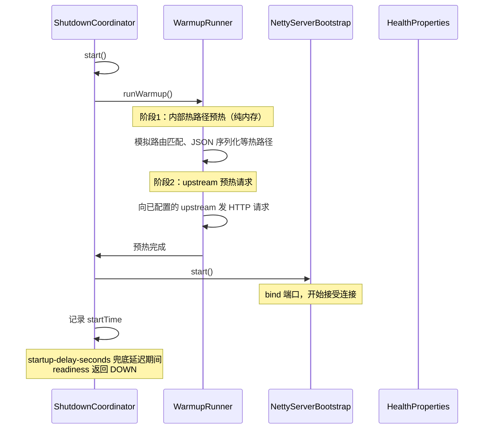
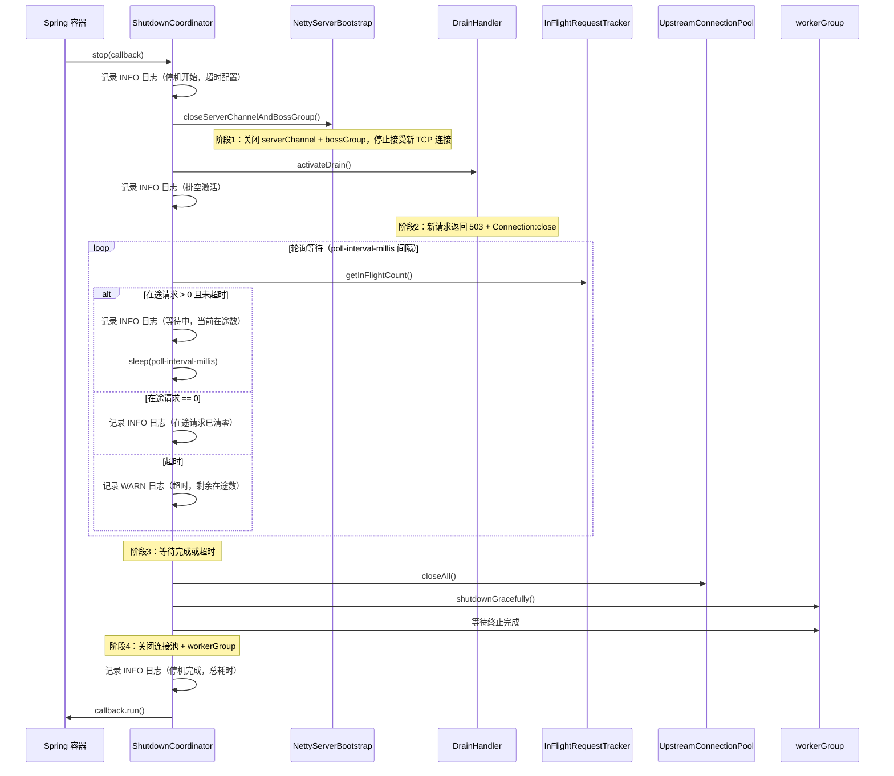
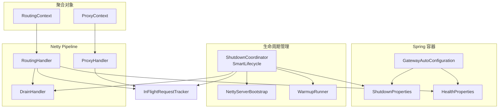

# 设计文档：优雅停机（Graceful Shutdown）

## 概述

本设计为 Netty 反向代理网关引入分阶段优雅停机机制、启动预热和 Kubernetes 友好的健康检查端点。

当前 `NettyServerBootstrap.stop()` 在关闭 `serverChannel` 后立即销毁连接池和 `EventLoopGroup`，正在处理的请求会被强制中断。此外，`workerGroup` Bean 上的 `destroyMethod = "shutdownGracefully"` 与 `SmartLifecycle.stop()` 存在关闭顺序竞争。

本设计引入以下核心变更：

1. **ShutdownCoordinator**：编排停机四阶段流程（关闭 serverChannel + bossGroup → 激活排空 → 等待在途请求 → 关闭连接池 + workerGroup）
2. **InFlightRequestTracker**：基于 `AtomicInteger` 的线程安全在途请求计数器
3. **DrainHandler**：Netty pipeline 中的排空拦截器，在 drain 状态下返回 503
4. **健康检查端点**：`/health/live`、`/health/ready`、`/health`，readiness 与 drain 状态联动
5. **启动预热**：bind 端口前执行内部热路径预热 + upstream 预热请求，配合 `startup-delay-seconds` 兜底
6. **配置扩展**：`ShutdownProperties`（停机参数）和 `HealthProperties`（启动延迟）
7. **构造函数重构**：引入 `RoutingContext` 和 `ProxyContext` 聚合对象，解决 RoutingHandler / ProxyHandler 构造函数参数过多问题

## 架构

### 启动预热流程



### 停机流程时序图



### 组件交互总览




## 组件与接口

### 1. RoutingContext（新增）

**包路径**：`com.lei.gateway.core.proxy`

聚合 RoutingHandler 的所有依赖，解决构造函数参数过多问题。

```java
public class RoutingContext {
    private final RouteResolver routeResolver;
    private final RequestLimitProperties requestLimitProperties;
    private final UpstreamConnectionPool connectionPool;
    private final MetricsCollector metricsCollector;
    private final AccessLogWriter accessLogWriter;
    private final ObservabilityProperties observabilityProperties;
    private final GatewaySecurityProcessor securityProcessor;
    private final InFlightRequestTracker inFlightTracker;
    private final DrainHandler drainHandler;
    private final HealthProperties healthProperties;

    // 全参构造函数 + getter
}
```

### 2. ProxyContext（新增）

**包路径**：`com.lei.gateway.core.proxy`

聚合 ProxyHandler 的所有依赖。

```java
public class ProxyContext {
    private final RequestLimitProperties requestLimitProperties;
    private final UpstreamConnectionPool connectionPool;
    private final MetricsCollector metricsCollector;
    private final AccessLogWriter accessLogWriter;
    private final ObservabilityProperties observabilityProperties;
    private final InFlightRequestTracker inFlightTracker;

    // 全参构造函数 + getter
}
```

### 3. InFlightRequestTracker（新增）

**包路径**：`com.lei.gateway.core.proxy`

线程安全的在途请求计数器。基于 `AtomicInteger` 实现，供 Netty EventLoop 多线程并发访问。

```java
public class InFlightRequestTracker {
    private final AtomicInteger count = new AtomicInteger(0);

    /** 在途请求 +1，在 RoutingHandler 分发请求给 ProxyHandler 时调用。 */
    public void increment();

    /** 在途请求 -1，在 ProxyHandler.completeRequest() 或异常终止时调用。 */
    public void decrement();

    /** 查询当前在途请求数。 */
    public int getInFlightCount();
}
```

**集成点**：
- `RoutingHandler.channelRead()`：在 `ctx.fireChannelRead(msg)` 之前调用 `increment()`
- `ProxyHandler.completeRequest()`：在方法开头（`requestCompleted.compareAndSet` 成功后）调用 `decrement()`
- `ProxyHandler.channelInactive()`：如果 `requestCompleted` 仍为 false，调用 `decrement()`（客户端断开但请求未完成的场景）

### 4. DrainHandler（新增）

**包路径**：`com.lei.gateway.core.proxy`

`@Sharable` 的 Netty `ChannelInboundHandlerAdapter`，在排空状态下拦截新 HTTP 请求。

```java
@ChannelHandler.Sharable
public class DrainHandler extends ChannelInboundHandlerAdapter {
    private volatile boolean draining = false;

    /** 激活排空模式。 */
    public void activateDrain();

    /** 查询是否处于排空状态。 */
    public boolean isDraining();

    @Override
    public void channelRead(ChannelHandlerContext ctx, Object msg);
}
```

**行为**：
- `draining == false`：透传 `ctx.fireChannelRead(msg)`
- `draining == true` 且 `msg instanceof HttpRequest` 且为健康检查路径（`/health`、`/health/live`、`/health/ready`）：透传 `ctx.fireChannelRead(msg)`，确保 K8s 探针在排空期间仍可获取状态
- `draining == true` 且 `msg instanceof HttpRequest` 且为非健康检查路径：返回 503 响应（`Connection: close`），然后关闭连接
- `draining == true` 且 `msg` 非 `HttpRequest`：释放 msg（`ReferenceCountUtil.release`）

**Pipeline 位置**：插入在 `traceContext` 和 `routing` 之间：
```
HttpServerCodec → IdleStateHandler → TraceContextHandler → DrainHandler → RoutingHandler
```

### 5. WarmupRunner（新增）

**包路径**：`com.lei.gateway.core.proxy`

启动预热执行器，在 bind 端口前执行两阶段预热。

```java
public class WarmupRunner {
    private final RouteResolver routeResolver;
    private final UpstreamConnectionPool connectionPool;

    /**
     * 执行预热，受 warmupTimeoutSeconds 总超时控制。
     * 阶段1：内部热路径 — 模拟路由匹配、JSON 序列化等纯内存操作，触发 JIT 编译。
     * 阶段2：upstream 预热 — 向已配置的 upstream 发 HTTP HEAD 请求，预热连接池和编解码路径。
     * 总超时到达后立即返回，不阻塞启动。
     */
    public void runWarmup();
}
```

**内部热路径预热**：
- 遍历已配置的路由，对每个路由的 path-prefix 执行 `routeResolver.resolve()` 若干次
- 构造模拟 JSON 字符串执行序列化/反序列化（触发 Jackson 类加载和 JIT）

**upstream 预热请求**：
- 遍历已配置的路由，向每个 upstream 发送 1 次 HTTP HEAD 请求（`/`）
- 使用 `connectionPool.acquire()` 获取连接，请求完成后归还，预热连接池创建路径
- 单个 upstream 请求超时使用连接池的 `connect-timeout-millis`
- 整体受 `warmup-timeout-seconds` 总超时控制，超时后放弃剩余 upstream 预热
- 预热请求失败不阻塞启动（记录 WARN 日志）

### 6. ShutdownCoordinator（新增）

**包路径**：`com.lei.gateway.core.proxy`

实现 `SmartLifecycle`，替代 `NettyServerBootstrap` 作为生命周期管理者。`NettyServerBootstrap` 不再实现 `SmartLifecycle`，改为普通组件。

```java
@Component
public class ShutdownCoordinator implements SmartLifecycle {
    private final NettyServerBootstrap serverBootstrap;
    private final DrainHandler drainHandler;
    private final InFlightRequestTracker inFlightTracker;
    private final UpstreamConnectionPool connectionPool;
    private final EventLoopGroup workerGroup;
    private final ShutdownProperties shutdownProperties;
    private final WarmupRunner warmupRunner;
    private volatile boolean running = false;

    @Override
    public void start();  // 执行预热 → 委托 serverBootstrap.start()

    @Override
    public void stop(Runnable callback);  // 四阶段停机编排

    @Override
    public boolean isRunning();

    @Override
    public int getPhase();  // 返回 Integer.MAX_VALUE - 1，确保最先停机
}
```

**`getPhase()` 说明**：Spring SmartLifecycle 的 phase 值越大，启动越晚、停机越早。网关作为流量入口，必须在其他业务 Bean（如数据库连接池、缓存）之前停止接收请求，否则停机期间进来的请求可能因依赖的 Bean 已销毁而报错。

**start() 实现逻辑**：
1. `warmupRunner.runWarmup()` — 执行预热
2. `serverBootstrap.start()` — bind 端口
3. `running = true`

**stop(Runnable callback) 实现逻辑**：
1. 记录 INFO 日志（停机开始，超时 = shutdownTimeoutSeconds）
2. `serverBootstrap.closeServerChannelAndBossGroup()` — 阶段1：关闭 serverChannel + bossGroup
3. `drainHandler.activateDrain()` — 阶段2：激活排空
4. 记录 INFO 日志（排空已激活）
5. 循环轮询 `inFlightTracker.getInFlightCount()`，间隔 `shutdownPollIntervalMillis` — 阶段3
   - 在途 > 0 且未超时：记录 INFO 日志，`Thread.sleep(pollInterval)`
   - 在途 == 0：跳出循环
   - 超时：记录 WARN 日志（含剩余在途数），跳出循环
6. `connectionPool.closeAll()` — 阶段4：关闭上游连接池
7. `workerGroup.shutdownGracefully().sync()` — 关闭 workerGroup 并等待完成
8. 记录 INFO 日志（停机完成，总耗时）
9. `callback.run()` — 通知 Spring 容器（必须在 finally 块中）

### 7. NettyServerBootstrap（修改）

**变更**：
- 移除 `implements SmartLifecycle` 及 `isRunning()`/`stop()` 方法
- 移除 `@Component` 注解（由 `GatewayAutoConfiguration` 显式创建 Bean）
- `start()` 改为普通 public 方法（由 `ShutdownCoordinator.start()` 调用）
- 新增 `closeServerChannelAndBossGroup()` 方法：同时关闭 serverChannel 和 bossGroup（bossGroup 唯一职责是 accept 新连接，serverChannel 关闭后 bossGroup 空转，合并关闭简化流程）
- 构造函数改为接收 `RoutingContext`、`ProxyContext` 和 `DrainHandler`
- `start()` 中创建 `RoutingHandler` 时传入 `RoutingContext`
- `GatewayChannelInitializer` 构造函数新增 `DrainHandler` 参数

### 8. RoutingHandler（修改）

**变更**：
- 构造函数改为 `(RoutingContext ctx, AtomicInteger activeConnections, Instant startTime)`，从 9+ 个参数缩减为 3 个
- `channelRead()` 中，在 `ctx.fireChannelRead(msg)` 之前调用 `inFlightTracker.increment()`
- 新增 `/health/live` 端点处理
- 新增 `/health/ready` 端点处理（检查 drain 状态 + 启动延迟）
- 修改 `/health` 端点保留现有行为
- 创建 ProxyHandler 时传入 `ProxyContext` 而非逐个参数

### 9. ProxyHandler（修改）

**变更**：
- 构造函数改为 `(Route route, ProxyContext ctx)`，从 6 个参数缩减为 2 个
- `completeRequest()`：在 `requestCompleted.compareAndSet(false, true)` 成功后调用 `inFlightTracker.decrement()`
- `channelInactive()`：如果 `requestCompleted.get() == false`，调用 `inFlightTracker.decrement()`
- `sendErrorAndCleanup()`：在 `requestCompleted.set(true)` 之前检查旧值，如果之前为 false 则调用 `inFlightTracker.decrement()`

### 10. GatewayChannelInitializer（修改）

**变更**：
- 构造函数新增 `DrainHandler` 参数
- `initChannel()` 中在 `traceContext` 和 `routing` 之间插入 `drain` handler：

```java
ch.pipeline()
    .addLast("httpCodec", new HttpServerCodec())
    .addLast("idleState", new IdleStateHandler(...))
    .addLast("traceContext", traceContextHandler)
    .addLast("drain", drainHandler)        // 新增
    .addLast("routing", routingHandler);
```

### 11. GatewayAutoConfiguration（修改）

**变更**：
- `workerGroup()` Bean 去掉 `destroyMethod`（由 ShutdownCoordinator 显式管理关闭）
- 新增 `ShutdownProperties` 和 `HealthProperties` 到 `@EnableConfigurationProperties`


## 数据模型

### ShutdownProperties（新增）

**包路径**：`com.lei.gateway.core.config`

```java
@Validated
@ConfigurationProperties(prefix = "gateway.shutdown")
public class ShutdownProperties {

    /** 优雅停机最大等待时间（秒），默认 30。 */
    @Min(1)
    private int shutdownTimeoutSeconds = 30;

    /** 等待在途请求完成时的轮询间隔（毫秒），默认 500。 */
    private int shutdownPollIntervalMillis = 500;

    // getter/setter
}
```

**配置示例**：
```yaml
gateway:
  shutdown:
    shutdown-timeout-seconds: 30
    shutdown-poll-interval-millis: 500
```

**校验**：`@Min(1)` 注解确保 `shutdownTimeoutSeconds >= 1`，Spring Boot 在 Bean 创建阶段自动校验，不合法时启动失败。

### HealthProperties（新增）

**包路径**：`com.lei.gateway.core.config`

```java
@Validated
@ConfigurationProperties(prefix = "gateway.health")
public class HealthProperties {

    /** 启动延迟秒数，默认 0（不延迟）。预热完成后的额外兜底等待时间。 */
    @Min(0)
    private int startupDelaySeconds = 0;

    /** 预热总超时秒数，默认 10。超时后放弃预热直接 bind 端口。 */
    @Min(1)
    private int warmupTimeoutSeconds = 10;

    // getter/setter
}
```

**配置示例**：
```yaml
gateway:
  health:
    startup-delay-seconds: 10
    warmup-timeout-seconds: 10
```

**校验**：`@Min(0)` 注解确保 `startupDelaySeconds >= 0`，小于 0 时启动失败。

### 健康检查端点响应格式

| 端点 | 条件 | HTTP 状态 | 响应体 |
|------|------|-----------|--------|
| `/health/live` | Netty 服务运行中 | 200 | `{"status":"UP"}` |
| `/health/ready` | 已过启动延迟 且 未排空 | 200 | `{"status":"UP"}` |
| `/health/ready` | 排空中 | 503 | `{"status":"DOWN","reason":"draining"}` |
| `/health/ready` | 启动延迟未过 | 503 | `{"status":"DOWN","reason":"warming_up"}` |
| `/health` | 任何时候 | 200 | `{"status":"UP","startTime":"...","activeConnections":N}` |

### 排空阶段 503 响应格式

```http
HTTP/1.1 503 Service Unavailable
Content-Type: application/json
Connection: close

{"status":503,"error":"Service Unavailable","message":"Server is shutting down"}
```


## 正确性属性（Correctness Properties）

*属性（Property）是在系统所有合法执行中都应成立的特征或行为——本质上是对系统应做什么的形式化陈述。属性是人类可读规格说明与机器可验证正确性保证之间的桥梁。*

### Property 1: 配置校验边界

*对于任意* `shutdownTimeoutSeconds` 值小于 1 的整数，`ShutdownProperties` 的 Bean Validation 应拒绝该值；*对于任意* `startupDelaySeconds` 值小于 0 的整数，`HealthProperties` 的 Bean Validation 应拒绝该值。反之，合法范围内的值应通过校验。

**Validates: Requirements 1.4, 8.3**

### Property 2: 在途请求计数 round-trip

*对于任意*正整数 N，对 `InFlightRequestTracker` 执行 N 次 `increment()` 后再执行 N 次 `decrement()`，最终 `getInFlightCount()` 应为 0。且在任意中间时刻，`getInFlightCount()` 应等于已执行的 increment 次数减去已执行的 decrement 次数。

**Validates: Requirements 2.1, 2.2**

### Property 3: 在途请求计数并发安全

*对于任意*正整数 M（线程数）和 N（每线程操作数），M 个线程各自执行 N 次 `increment()` 后再各自执行 N 次 `decrement()`，最终 `getInFlightCount()` 应为 0。

**Validates: Requirements 2.3**

### Property 4: 排空状态下拒绝所有请求

*对于任意* HTTP 请求（任意 method、任意 URI），当 `DrainHandler` 处于排空状态时，应返回 HTTP 503 响应，且响应头包含 `Connection: close`。

**Validates: Requirements 4.1, 4.2**

### Property 5: 非排空状态下透传所有请求

*对于任意* HTTP 请求（任意 method、任意 URI），当 `DrainHandler` 未处于排空状态时，请求应被透传给下游 Handler，DrainHandler 不产生任何响应。

**Validates: Requirements 4.4**

### Property 6: Readiness 端点状态矩阵

*对于任意*布尔组合 `(isDraining, isWarmupComplete)`，`/health/ready` 端点的行为应满足：
- `isDraining == true` → HTTP 503，body 包含 `"reason":"draining"`
- `isDraining == false && isWarmupComplete == false` → HTTP 503，body 包含 `"reason":"warming_up"`
- `isDraining == false && isWarmupComplete == true` → HTTP 200，body 包含 `"status":"UP"`

**Validates: Requirements 7.2, 7.3, 7.4, 8.4**


## 错误处理

### 停机阶段错误

| 阶段 | 可能错误 | 处理策略 |
|------|---------|---------|
| 关闭 serverChannel + bossGroup | `serverChannel` 为 null（启动失败） | 跳过，继续下一阶段 |
| 激活排空 | 无（仅设置 volatile 标志） | — |
| 等待在途请求 | `InterruptedException`（sleep 被中断） | 恢复中断标志，立即进入下一阶段 |
| 关闭连接池 + workerGroup | 池已关闭 / `InterruptedException` | `closeAll()` 幂等；中断时恢复标志，记录 WARN 日志 |

### 关键原则

- 停机流程中任何阶段的异常不应阻止后续阶段执行（catch-and-continue）
- 每个阶段的异常都应记录 ERROR 日志（含异常对象）
- `callback.run()` 必须在 finally 块中调用，确保 Spring 容器不会无限等待

### 预热阶段错误

- 内部热路径预热失败：记录 WARN 日志，不阻塞启动
- upstream 预热请求失败（连接超时、upstream 不可达）：记录 WARN 日志，不阻塞启动
- `warmup-timeout-seconds` 总超时到达：放弃剩余 upstream 预热，记录 WARN 日志，直接 bind 端口
- 预热阶段的任何异常都不应阻止 bind 端口

### InFlightRequestTracker 防御

- `decrement()` 应检查当前值是否 > 0，避免计数变为负数（防御性编程）
- 如果 `decrement()` 时计数已为 0，记录 WARN 日志（表明存在 bug：多次 decrement）

### DrainHandler 错误

- 写 503 响应失败时（channel 已关闭），忽略异常，不影响其他连接
- `exceptionCaught()` 中关闭连接

## 测试策略

### 属性测试（Property-Based Testing）

使用 **jqwik 1.9.x** 作为属性测试框架。每个属性测试至少运行 100 次迭代。

每个属性测试必须用注释标注对应的设计属性：

```java
// Feature: graceful-shutdown, Property 1: 配置校验边界
@Property(tries = 100)
void configValidationBoundary(@ForAll @IntRange(min = Integer.MIN_VALUE, max = 0) int timeout) {
    // ...
}
```

| 属性 | 测试类 | 说明 |
|------|--------|------|
| Property 1 | `ShutdownPropertiesPropertyTest` | 生成随机整数，验证校验边界 |
| Property 2 | `InFlightRequestTrackerPropertyTest` | 生成随机 N，验证 increment/decrement round-trip |
| Property 3 | `InFlightRequestTrackerPropertyTest` | 生成随机线程数和操作数，验证并发安全 |
| Property 4 | `DrainHandlerPropertyTest` | 生成随机 HTTP method + URI，验证排空拒绝行为 |
| Property 5 | `DrainHandlerPropertyTest` | 生成随机 HTTP method + URI，验证透传行为 |
| Property 6 | `HealthEndpointPropertyTest` | 枚举 (draining, warmupComplete) 组合，验证响应 |

### 单元测试（JUnit 5）

| 测试类 | 覆盖范围 |
|--------|---------|
| `ShutdownPropertiesTest` | 默认值验证（Req 1.1, 1.2）|
| `HealthPropertiesTest` | 默认值验证（Req 8.1）|
| `InFlightRequestTrackerTest` | 基本 increment/decrement、边界（decrement 到 0 以下）|
| `DrainHandlerTest` | 排空前后状态切换、非 HttpRequest 消息处理 |
| `ShutdownCoordinatorTest` | 停机阶段顺序验证（mock 依赖）、超时行为、在途请求为 0 立即完成 |
| `RoutingHandlerTest` | `/health/live`、`/health/ready`、`/health` 端点响应 |
| `WarmupRunnerTest` | 预热执行、upstream 不可达时不阻塞 |

### 集成测试

| 测试类 | 覆盖范围 |
|--------|---------|
| `GracefulShutdownIntegrationTest` | 端到端停机流程：发送请求 → 触发停机 → 验证在途请求完成 → 验证新请求被拒绝 |

### 测试命名约定

- 属性测试：`*PropertyTest.java`（jqwik）
- 单元测试：`*Test.java`（JUnit 5）
- 集成测试：`*IntegrationTest.java`（JUnit 5）
