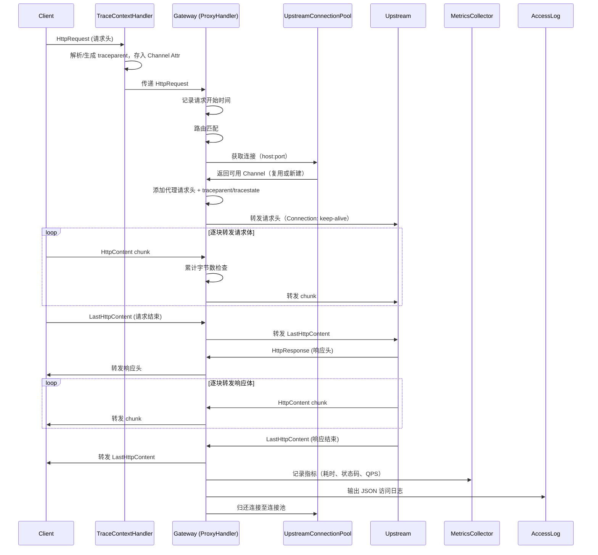

# 技术设计文档：Netty Gateway

## 概述

本设计描述一个基于 JDK 21、Netty 4.2.x 和 Spring Boot 的 HTTP 反向代理网关。网关接收客户端 HTTP/1.1 请求，根据路径前缀匹配路由规则，以全流式方式将请求逐块转发至上游服务，并将响应逐块返回给客户端。

核心设计原则（参考 Envoy、Spring Cloud Gateway、Zuul 2 的业界实践）：
- JDK 21 运行环境
- **全流式转发**：不使用 HttpObjectAggregator，所有请求和响应都逐块转发，不聚合到内存
- **统一处理**：不区分 multipart 和非 multipart，一个 ProxyHandler 处理所有类型的请求
- 路由配置通过 Spring Boot application.yml 管理
- Netty 服务生命周期与 Spring Boot 集成
- 转发请求时添加标准代理请求头（X-Forwarded-For/Host/Proto、X-Real-IP）
- 请求大小限制基于 Content-Length 头预检 + 已传输字节数累计检查
- **泛型资源连接池**：独立的 gateway-pool 模块，参考 HikariCP ConcurrentBag 设计，纯 Java 实现，不依赖 Netty
- **Upstream 连接池复用**：gateway-core 通过适配器将 Netty Channel 接入泛型连接池，按 upstream host:port 分组维护
- **Client Keep-Alive**：HTTP/1.1 默认保持连接，同一连接上处理多个请求
- **可观测性**：Micrometer 指标（RED method）+ 结构化 JSON 访问日志 + W3C Trace Context 分布式追踪，所有开关可通过配置独立控制

### 项目结构

采用 Maven 多模块结构：

```
netty-gateway/                  (父 POM)
├── gateway-pool/               (泛型资源连接池，纯 Java，不依赖 Netty)
├── gateway-core/               (网关核心，依赖 gateway-pool)
│   └── src/main/java/...
└── gateway-example/            (测试用上游服务示例)
    └── src/main/java/...
```

- **gateway-pool**：泛型资源连接池模块，参考 HikariCP ConcurrentBag 设计。纯 Java 实现，不依赖 Netty 或 Spring，可独立复用
- **gateway-core**：网关核心模块，依赖 gateway-pool，包含 Netty 服务、路由匹配、流式请求转发，通过 ChannelPoolEntry 适配器将 Netty Channel 接入泛型连接池
- **gateway-example**：基于 Spring Boot Web 的 mock 上游服务，包含普通 REST 接口（GET/POST）、文件上传接口和大文件下载接口，用于开发和测试时验证网关功能

## 架构

### 整体架构

```
Client ──HTTP/1.1──▶ Netty Server (Gateway Port)
          (Keep-Alive)       │
                    ChannelPipeline
                         │
                    ┌──────────────────────┐
                    │ HttpServerCodec       │  HTTP 编解码
                    │ IdleStateHandler      │  超时检测
                    │ TraceContextHandler   │  W3C Trace Context 解析/生成
                    │ RoutingHandler        │  路由匹配 + 健康检查 + 指标端点
                    │ ProxyHandler          │  全流式转发 + 指标记录 + 访问日志
                    └──────────────────────┘
                          │
                  UpstreamConnectionPool
                    (按 host:port 分组)
                          │
                    ▼ Upstream Service

                  MetricsCollector ──▶ Micrometer MeterRegistry ──▶ /metrics (Prometheus)
```

### Pipeline 设计

网关的 ChannelPipeline 采用极简设计，参考 Envoy 的透明代理模式：**所有请求统一走流式转发路径，不区分请求类型，不聚合请求体到内存。**

Pipeline 组成（5 个 Handler）：
1. `HttpServerCodec` — HTTP 编解码，将字节流解码为 HttpRequest / HttpContent / LastHttpContent
2. `IdleStateHandler` — 读写超时检测
3. `TraceContextHandler` — 解析或生成 W3C traceparent/tracestate，将 trace-id 存入 Channel Attribute（可通过配置禁用）
4. `RoutingHandler` — 路由匹配与请求分发，处理 /health 和 /metrics 端点
5. `ProxyHandler` — 统一的全流式转发处理器，集成指标记录和访问日志输出

**关键设计决策：不使用 HttpObjectAggregator**
- 传统网关（如早期 Zuul 1）会将请求体聚合到内存，对大文件上传不友好
- 本网关参考 Envoy / Spring Cloud Gateway 的做法，所有请求体都逐块转发
- 这意味着 ProxyHandler 处理的是 HttpRequest + N 个 HttpContent + LastHttpContent，而非 FullHttpRequest

### 请求转发流程




## 组件与接口

### 1. NettyServerBootstrap

Spring Boot 生命周期集成组件，负责 Netty 服务的启动和关闭。

```java
@Component
public class NettyServerBootstrap implements SmartLifecycle {
    // Spring Boot 启动完成后启动 Netty
    void start();
    // Spring Boot 关闭时优雅停机
    void stop();
    boolean isRunning();
}
```

- 实现 `SmartLifecycle` 接口，在 Spring 容器就绪后启动 Netty
- 优雅关闭：先关闭 bossGroup 停止接受新连接，再等待 workerGroup 处理完已有请求
- 启动失败时通过 `SpringApplication` 终止应用

### 2. GatewayChannelInitializer

配置每个新连接的 ChannelPipeline。

```java
public class GatewayChannelInitializer extends ChannelInitializer<SocketChannel> {
    void initChannel(SocketChannel ch);
}
```

Pipeline 组成（5 个 Handler）：
- `HttpServerCodec` — HTTP 编解码
- `IdleStateHandler` — 读写超时检测
- `TraceContextHandler` — W3C Trace Context 解析/生成（可配置禁用）
- `RoutingHandler` — 路由匹配与请求分发，处理 /health 和 /metrics 端点
- `ProxyHandler` — 由 RoutingHandler 动态添加

### 3. RoutingHandler

入站处理器，负责路由匹配和请求分发。

```java
@ChannelHandler.Sharable
public class RoutingHandler extends ChannelInboundHandlerAdapter {
    void channelRead(ChannelHandlerContext ctx, Object msg);
}
```

职责：
- 拦截 `HttpRequest`，提取请求路径
- `/health` 路径直接返回健康信息（JSON 格式，包含 status、startTime、activeConnections）
- `/metrics` 路径（指标采集启用时）返回 Prometheus 格式的指标数据，委托 MetricsCollector 输出
- 根据路径前缀匹配路由规则，找到目标 Upstream
- 匹配成功后动态向 Pipeline 添加 `ProxyHandler`，并将 HttpRequest 传递给它
- 未匹配返回 404
- **Keep-Alive 支持**：每个请求处理完成后（ProxyHandler 从 Pipeline 移除后），重置状态准备处理同一连接上的下一个请求
- 如果 Client 发送了 `Connection: close` 头，在响应完成后关闭连接

### 4. ProxyHandler

统一的全流式转发处理器，处理所有类型的请求（包括普通请求和文件上传）。

```java
public class ProxyHandler extends ChannelInboundHandlerAdapter {
    ProxyHandler(Route route, RequestLimitProperties limitConfig, UpstreamConnectionPool connectionPool,
                 MetricsCollector metricsCollector, AccessLogWriter accessLogWriter, ObservabilityProperties observabilityConfig);
    void channelRead(ChannelHandlerContext ctx, Object msg);
    void channelInactive(ChannelHandlerContext ctx);
}
```

职责与处理流程：
- **收到 HttpRequest 时**：
  1. 记录请求开始时间（`System.nanoTime()`）
  2. 从 Channel Attribute 读取 trace-id（由 TraceContextHandler 预先设置）
  3. Content-Length 预检：确定 maxRequestSize（如果 Route 配置了 maxRequestSize 则使用该值，否则使用全局 RequestLimitProperties.maxRequestSize），如果 Content-Length 头存在且超过该值，直接返回 413
  4. 从 `UpstreamConnectionPool` 获取到 Upstream 的连接（复用已有连接或新建）
  5. 调用 `ProxyHeaderUtil.addProxyHeaders()` 添加代理请求头
  6. 添加 `traceparent` 和 `tracestate` 头（值来自 Channel Attribute，追踪启用时）
  7. 设置 `Connection: keep-alive` 头，使用 HTTP/1.1 转发
  8. 确定超时时间：如果 Route 配置了 timeoutSeconds 则使用该值，否则使用全局 RequestLimitProperties.timeoutSeconds
  9. 转发请求头到 Upstream
- **收到 HttpContent 时**：
  1. 累计已传输字节数，超过 maxRequestSize 时终止传输并返回 413
  2. 逐块转发到 Upstream
- **收到 LastHttpContent 时**：
  1. 转发到 Upstream，标记请求体结束
- **收到 Upstream 的 HttpResponse 时**：转发响应头给 Client
- **收到 Upstream 的 HttpContent 时**：逐块转发给 Client
- **收到 Upstream 的 LastHttpContent 时**：
  1. 转发给 Client
  2. 计算响应耗时（当前时间 - 请求开始时间）
  3. 调用 `MetricsCollector.recordRequest()` 记录指标（耗时、状态码）
  4. 调用 `AccessLogWriter.log()` 输出 JSON 访问日志（包含 trace-id 等）
  5. 将连接归还连接池，从 Pipeline 移除自身
- **Client 断开连接时**：释放资源，关闭 Upstream 连接（不归还连接池）

### 5. ProxyHeaderUtil

代理请求头处理工具类。

```java
public class ProxyHeaderUtil {
    /**
     * 为转发请求添加标准代理请求头
     * @param headers 原始请求头（将被修改）
     * @param clientIp 客户端真实 IP
     * @param upstreamHost upstream 的 host
     */
    static void addProxyHeaders(HttpHeaders headers, String clientIp, String upstreamHost);
}
```

代理请求头处理规则（参考 RFC 7239 和 Nginx 标准实践）：
- 保留原始请求头
- `X-Forwarded-For`：追加客户端真实 IP。如果已有该头，用逗号分隔追加；如果没有则新增
- `X-Forwarded-Host`：设置为原始请求的 Host 头值
- `X-Forwarded-Proto`：设置为原始协议（http 或 https）
- `X-Real-IP`：设置为客户端真实 IP
- `Host`：修改为 Upstream 的 host

### 6. RouteConfig / Route

路由配置模型，从 Spring Boot 配置加载。

```java
@ConfigurationProperties(prefix = "gateway")
public class GatewayProperties {
    List<Route> routes;
}

public class Route {
    String id;
    String pathPrefix;
    String upstream;       // 例如 "http://localhost:8081"
    Integer timeoutSeconds; // 可选，覆盖全局超时配置
    Long maxRequestSize;    // 可选，覆盖全局请求大小限制（字节）
}
```

### 7. RequestLimitProperties

请求大小限制与超时配置。

```java
@ConfigurationProperties(prefix = "gateway.request-limit")
public class RequestLimitProperties {
    long maxRequestSize = 50 * 1024 * 1024;     // 50MB
    int timeoutSeconds = 60;
}
```

- 去掉了原来的 maxFileSize 配置——全流式架构下不区分"单个文件"和"整个请求"，统一用 maxRequestSize 限制
- 大小检查采用双重机制：Content-Length 头预检 + 已传输字节数累计检查

### 8. RouteResolver

路由匹配逻辑，从路由配置中查找匹配的路由。

```java
@Component
public class RouteResolver {
    // 根据请求路径前缀匹配路由
    Optional<Route> resolve(String path);
}
```

### 9. gateway-pool 模块（泛型资源连接池）

独立的泛型资源池模块，参考 HikariCP ConcurrentBag 设计。纯 Java 实现，不依赖 Netty 或 Spring。

#### 9.1 PoolEntry 接口

池化条目必须实现的接口，定义状态管理和生命周期方法。

```java
public interface PoolEntry {
    int STATE_NOT_IN_USE = 0;
    int STATE_IN_USE = 1;
    int STATE_REMOVED = 2;

    int getState();
    boolean compareAndSet(int expect, int update);
    long getLastAccessTime();
    void setLastAccessTime(long time);
    void close();
    boolean isAlive();
}
```

#### 9.2 ConcurrentPool\<T extends PoolEntry\>

核心池化容器，参考 HikariCP ConcurrentBag 的三级获取策略。

```java
public class ConcurrentPool<T extends PoolEntry> {
    ConcurrentPool(PoolConfig config, PoolEntryFactory<T> factory);

    // 借用资源（三级获取策略）
    T borrow(long timeout, TimeUnit unit) throws InterruptedException;

    // 归还资源
    void requite(T entry);

    // 移除资源（资源不可用时）
    void remove(T entry);

    // 关闭池
    void close();
}
```

三级获取策略（参考 HikariCP）：
1. **ThreadLocal 快速路径** — 优先从当前线程上次归还的条目中获取（无锁，CAS 切换 STATE_NOT_IN_USE → STATE_IN_USE）
2. **共享列表 CAS 扫描** — ThreadLocal 没有时，遍历 CopyOnWriteArrayList，用 CAS 标记 STATE_NOT_IN_USE → STATE_IN_USE
3. **SynchronousQueue handoff** — 前两级都没有时，等待其他线程归还或工厂创建新条目

#### 9.3 PoolEntryFactory\<T extends PoolEntry\>

创建新条目的工厂接口。

```java
public interface PoolEntryFactory<T extends PoolEntry> {
    T create() throws Exception;
}
```

#### 9.4 PoolConfig

池配置。

```java
public class PoolConfig {
    int maxPoolSize = 50;              // 最大池大小
    int maxIdleTimeSeconds = 60;       // 空闲条目最大存活时间
    int connectionTimeoutMillis = 500;  // 获取条目超时
}
```

#### 9.5 IdleEvictor

空闲条目清理器，作为定时任务运行。

```java
class IdleEvictor implements Runnable {
    // 扫描池中所有 STATE_NOT_IN_USE 的条目
    // 如果空闲时间超过 maxIdleTimeSeconds，CAS 标记为 STATE_REMOVED 并关闭
}
```

### 10. gateway-core 连接池适配

gateway-core 通过适配器将 Netty Channel 接入泛型连接池。

#### 10.1 ChannelPoolEntry

将 Netty Channel 适配为 PoolEntry。

```java
public class ChannelPoolEntry implements PoolEntry {
    private final Channel channel;
    private volatile int state;
    private volatile long lastAccessTime;

    // getState() → 返回 state
    // compareAndSet() → 用 AtomicIntegerFieldUpdater 做 CAS
    // isAlive() → channel.isActive()
    // close() → channel.close()
}
```

#### 10.2 ChannelPoolEntryFactory

使用 Netty Bootstrap 创建到 upstream 的 TCP 连接。

```java
public class ChannelPoolEntryFactory implements PoolEntryFactory<ChannelPoolEntry> {
    ChannelPoolEntry create() throws Exception;
}
```

#### 10.3 UpstreamConnectionPool

按 Upstream host:port 分组，每组一个 ConcurrentPool\<ChannelPoolEntry\>。

```java
@Component
public class UpstreamConnectionPool {
    // 按 host:port 分组，每组一个 ConcurrentPool<ChannelPoolEntry>
    private final ConcurrentHashMap<String, ConcurrentPool<ChannelPoolEntry>> pools;

    Future<Channel> acquire(String host, int port);
    void release(Channel channel);
    void closeAll();
}
```

设计要点：
- 连接池按 `host:port` 分组，每组独立管理，每组对应一个 `ConcurrentPool<ChannelPoolEntry>` 实例
- `acquire` 内部调用 `ConcurrentPool.borrow()`，超时后返回失败（ProxyHandler 返回 503）
- `release` 内部调用 `ConcurrentPool.requite()`，如果 channel 不再 active 则调用 `remove()`
- 转发到 upstream 时使用 HTTP/1.1 并设置 `Connection: keep-alive`

### 11. ConnectionPoolProperties

Upstream 连接池配置，保持在 gateway-core 中（Spring Boot 配置绑定），内部映射到 gateway-pool 的 PoolConfig。

```java
@ConfigurationProperties(prefix = "gateway.connection-pool")
public class ConnectionPoolProperties {
    int maxConnectionsPerHost = 50;       // 映射到 PoolConfig.maxPoolSize
    int maxIdleTimeSeconds = 60;          // 映射到 PoolConfig.maxIdleTimeSeconds
    int slowConnectThresholdMillis = 50;  // 慢连接监控阈值，超过此值记录指标/日志
    int connectTimeoutMillis = 500;       // 连接建立硬超时，映射到 PoolConfig.connectionTimeoutMillis
}
```

### 12. gateway-example 模块

基于 Spring Boot Web 的 mock 上游服务，用于开发和测试时验证网关功能。

```java
@RestController
public class ExampleController {
    // 普通 GET
    @GetMapping("/api/example/hello")
    ResponseEntity<String> hello();

    // POST echo 请求体
    @PostMapping("/api/example/echo")
    ResponseEntity<String> echo(@RequestBody String body);

    // 单文件上传
    @PostMapping("/api/example/upload")
    ResponseEntity<String> upload(@RequestParam("file") MultipartFile file);

    // 多文件上传
    @PostMapping("/api/example/upload/multi")
    ResponseEntity<String> uploadMulti(@RequestParam("files") List<MultipartFile> files);

    // 文件上传 + 表单字段混合
    @PostMapping("/api/example/upload/with-fields")
    ResponseEntity<String> uploadWithFields(
        @RequestParam("file") MultipartFile file,
        @RequestParam("name") String name,
        @RequestParam("description") String description);

    // 大文件下载（测试响应流式转发）
    @GetMapping("/api/example/download")
    ResponseEntity<Resource> download();
}
```

- 监听独立端口（如 8081），作为网关的 Upstream 目标
- 仅用于开发测试，不包含业务逻辑
- Spring Boot 配置需设置 `spring.servlet.multipart.max-file-size` 和 `spring.servlet.multipart.max-request-size`（因为 example 是普通 Spring Boot Web 应用，需要 Spring MVC 的 multipart 配置）
- gateway-core 不需要 multipart 配置（用 Netty 原生处理，不经过 Spring MVC）

### 13. ObservabilityProperties

可观测性配置，控制指标、访问日志和分布式追踪的开关。

```java
@ConfigurationProperties(prefix = "gateway.observability")
public class ObservabilityProperties {
    boolean metricsEnabled = true;
    boolean accessLogEnabled = true;
    String accessLogLevel = "WARN";       // SLF4J 日志级别
    boolean tracingEnabled = true;
}
```

### 14. MetricsCollector

指标采集器，封装 Micrometer MeterRegistry 的指标注册和记录。

依赖：micrometer-core + micrometer-registry-prometheus（非 spring-boot-starter-web）。Spring Boot 自动配置创建 PrometheusMeterRegistry 并自动绑定 JVM MeterBinders。RoutingHandler 的 /metrics 端点调用 `registry.scrape()` 输出 Prometheus 格式文本。

```java
@Component
public class MetricsCollector {
    MetricsCollector(MeterRegistry meterRegistry, ObservabilityProperties config);

    // 记录一次代理请求的指标（耗时 + 状态码分类计数）
    void recordRequest(String method, String path, int statusCode, long durationNanos);

    // 记录一次 upstream 连接建立的耗时（同时判断是否为慢连接）
    void recordUpstreamConnect(String upstream, long durationNanos, boolean success);

    // 记录一次连接池借用失败
    void recordPoolBorrowFailure(String upstream);

    // 注册活跃连接数 gauge（由 NettyServerBootstrap 调用）
    void registerActiveConnections(AtomicInteger activeConnectionsGauge);

    // 注册连接池指标 gauge（由 UpstreamConnectionPool 调用，每个 host:port 一组）
    void registerPoolMetrics(String hostPort, ConcurrentPool<?> pool);

    // 注册 JVM 指标（JvmMemoryMetrics、JvmGcMetrics、JvmThreadMetrics）
    void registerJvmMetrics();

    // 注册 Netty 运行时指标（EventLoop pending tasks、ByteBuf allocator memory）
    void registerNettyMetrics(EventLoopGroup workerGroup, ByteBufAllocator allocator);

    // 输出 Prometheus 格式文本（供 /metrics 端点使用）
    String scrape();
}
```

指标设计（参考 RED method）：
- `gateway.requests.total`（Counter）— 请求总数，tag: method, path, status
- `gateway.requests.duration`（Timer）— 请求耗时，自动计算 P50/P95/P99，tag: method, path
- `gateway.requests.errors`（Counter）— 错误计数，tag: status_class (4xx / 5xx)
- `gateway.connections.active`（Gauge）— 当前活跃 Client 连接数
- `gateway.pool.active`（Gauge）— 连接池活跃条目数，tag: upstream
- `gateway.pool.idle`（Gauge）— 连接池空闲条目数，tag: upstream
- `gateway.pool.total`（Gauge）— 连接池总条目数，tag: upstream
- `gateway.upstream.connect.duration`（Timer）— Upstream 连接建立耗时分布，tag: upstream
- `gateway.upstream.connect.slow`（Counter）— 慢连接计数（超过 slowConnectThresholdMillis），tag: upstream
- `gateway.upstream.connect.failures`（Counter）— 连接建立失败计数，tag: upstream
- `gateway.pool.borrow.failures`（Counter）— 连接池借用失败计数（池满超时），tag: upstream

JVM 指标（通过 Micrometer MeterBinder 自动注册）：
- JVM heap memory（`jvm.memory.used`、`jvm.memory.max` 等）
- GC count/duration（`jvm.gc.pause` 等）
- Thread count（`jvm.threads.live`、`jvm.threads.peak` 等）

Netty 运行时指标：
- `netty.eventloop.pending.tasks`（Gauge）— EventLoop 待处理任务数
- `netty.allocator.used.direct.memory`（Gauge）— ByteBuf allocator 直接内存使用量
- `netty.allocator.used.heap.memory`（Gauge）— ByteBuf allocator 堆内存使用量

当 `metricsEnabled = false` 时，`recordRequest` 等方法为空操作（no-op），不注册任何 Meter。

**ConcurrentPool 指标暴露**：ConcurrentPool 新增查询方法，供 MetricsCollector 注册 gauge 回调：

```java
// 新增到 ConcurrentPool<T extends PoolEntry>
int getActiveCount();   // 状态为 STATE_IN_USE 的条目数
int getIdleCount();     // 状态为 STATE_NOT_IN_USE 的条目数
int getTotalCount();    // 共享列表中所有未 REMOVED 的条目数
```

### 15. TraceContextHandler

W3C Trace Context 解析和生成处理器，作为 Pipeline 中的入站 Handler。

```java
@ChannelHandler.Sharable
public class TraceContextHandler extends ChannelInboundHandlerAdapter {
    TraceContextHandler(ObservabilityProperties config);
    void channelRead(ChannelHandlerContext ctx, Object msg);
}
```

职责：
- 仅处理 `HttpRequest` 消息，其他消息直接传递
- 如果请求携带 `traceparent` 头：解析 trace-id 和 span-id，生成新的 span-id（网关作为一个 span），将更新后的 traceparent 和原始 tracestate 存入 Channel Attribute
- 如果请求未携带 `traceparent` 头：生成新的 trace-id（16 字节随机 hex）和 span-id（8 字节随机 hex），构造 traceparent 头值（`00-{trace-id}-{span-id}-01`），存入 Channel Attribute
- 当 `tracingEnabled = false` 时，直接传递消息，不做任何处理

**traceparent 格式**（W3C Trace Context Level 1）：
```
version-traceid-parentid-traceflags
00-4bf92f3577b34da6a3ce929d0e0e4736-00f067aa0ba902b7-01
```

### 16. AccessLogWriter

结构化访问日志输出器，参考 Envoy access log 模式。

```java
@Component
public class AccessLogWriter {
    AccessLogWriter(ObservabilityProperties config);

    // 输出一条 JSON 格式的访问日志
    void log(AccessLogEntry entry);
}
```

使用 SLF4J Logger 输出，日志级别由 `ObservabilityProperties.accessLogLevel` 控制。当 `accessLogEnabled = false` 时为空操作。

AccessLogEntry 数据结构：

```java
public class AccessLogEntry {
    String method;           // 请求方法
    String path;             // 请求路径
    int statusCode;          // HTTP 状态码
    long durationMs;         // 响应耗时（毫秒）
    String clientIp;         // 客户端 IP
    String upstream;         // Upstream 地址
    long requestBodySize;    // 请求体大小（字节）
    long responseBodySize;   // 响应体大小（字节）
    String traceId;          // trace-id（追踪启用时）
}
```

JSON 输出示例：
```json
{
  "method": "POST",
  "path": "/api/example/upload",
  "statusCode": 200,
  "durationMs": 42,
  "clientIp": "192.168.1.100",
  "upstream": "http://localhost:8081",
  "requestBodySize": 1048576,
  "responseBodySize": 256,
  "traceId": "4bf92f3577b34da6a3ce929d0e0e4736"
}
```


## 数据模型

### Route（路由规则）

| 字段 | 类型 | 说明 |
|------|------|------|
| id | String | 路由唯一标识 |
| pathPrefix | String | 匹配路径前缀，如 `/api/user` |
| upstream | String | 上游服务地址，如 `http://localhost:8081` |
| timeoutSeconds | Integer | 可选，路由级别超时时间（秒），覆盖全局 timeoutSeconds |
| maxRequestSize | Long | 可选，路由级别请求大小限制（字节），覆盖全局 maxRequestSize |

### GatewayProperties（网关配置）

| 字段 | 类型 | 说明 |
|------|------|------|
| port | int | Netty 监听端口，默认 8080 |
| routes | List\<Route\> | 路由规则列表 |

### RequestLimitProperties（请求限制配置）

| 字段 | 类型 | 说明 |
|------|------|------|
| maxRequestSize | long | 单次请求最大大小，默认 50MB |
| timeoutSeconds | int | 请求传输超时时间，默认 60 秒 |

### ConnectionPoolProperties（连接池配置）

| 字段 | 类型 | 说明 |
|------|------|------|
| maxConnectionsPerHost | int | 每个 upstream 最大连接数，默认 50，映射到 PoolConfig.maxPoolSize |
| maxIdleTimeSeconds | int | 空闲连接最大存活时间，默认 60 秒，映射到 PoolConfig.maxIdleTimeSeconds |
| slowConnectThresholdMillis | int | 慢连接监控阈值，默认 50ms，超过此值记录指标/日志 |
| connectTimeoutMillis | int | 建立连接硬超时，默认 500ms，映射到 PoolConfig.connectionTimeoutMillis |

### PoolConfig（泛型池配置，gateway-pool 模块）

| 字段 | 类型 | 说明 |
|------|------|------|
| maxPoolSize | int | 最大池大小，默认 50 |
| maxIdleTimeSeconds | int | 空闲条目最大存活时间，默认 60 秒 |
| connectionTimeoutMillis | int | 获取条目超时，默认 500ms |

### HealthInfo（健康信息）

| 字段 | 类型 | 说明 |
|------|------|------|
| status | String | 运行状态，固定 "UP" |
| startTime | String | 网关启动时间（ISO 8601） |
| activeConnections | int | 当前活跃连接数 |

### ObservabilityProperties（可观测性配置）

| 字段 | 类型 | 说明 |
|------|------|------|
| metricsEnabled | boolean | 是否启用指标采集，默认 true |
| accessLogEnabled | boolean | 是否启用访问日志，默认 true |
| accessLogLevel | String | 访问日志级别，默认 "WARN" |
| tracingEnabled | boolean | 是否启用分布式追踪，默认 true |

### AccessLogEntry（访问日志条目）

| 字段 | 类型 | 说明 |
|------|------|------|
| method | String | 请求方法 |
| path | String | 请求路径 |
| statusCode | int | HTTP 状态码 |
| durationMs | long | 响应耗时（毫秒） |
| clientIp | String | 客户端 IP |
| upstream | String | Upstream 地址 |
| requestBodySize | long | 请求体大小（字节） |
| responseBodySize | long | 响应体大小（字节） |
| traceId | String | trace-id（追踪启用时，否则为 null） |

### application.yml 配置示例

```yaml
# gateway-core 配置
gateway:
  port: 8080
  routes:
    - id: example-service
      path-prefix: /api/example
      upstream: http://localhost:8081
    - id: slow-service
      path-prefix: /api/slow
      upstream: http://localhost:8082
      timeout-seconds: 120          # 路由级别超时，覆盖全局默认值
    - id: upload-service
      path-prefix: /api/upload
      upstream: http://localhost:8083
      max-request-size: 104857600   # 路由级别请求大小限制 100MB，覆盖全局默认值
  request-limit:
    max-request-size: 52428800   # 50MB
    timeout-seconds: 60
  connection-pool:
    max-connections-per-host: 50
    max-idle-time-seconds: 60
    slow-connect-threshold-millis: 50
    connect-timeout-millis: 500
  observability:
    metrics-enabled: true
    access-log-enabled: true
    access-log-level: WARN
    tracing-enabled: true
```

```yaml
# gateway-example 配置
server:
  port: 8081

spring:
  servlet:
    multipart:
      max-file-size: 50MB
      max-request-size: 50MB
```


## 正确性属性

*属性（Property）是指在系统所有合法执行中都应成立的特征或行为——本质上是对系统行为的形式化陈述。属性是人类可读规格说明与机器可验证正确性保证之间的桥梁。*

### Property 1: 路由匹配正确性

*对于任意*路由配置列表和任意请求路径，如果该路径以某条路由的 pathPrefix 开头，则 RouteResolver 应返回该路由（包含正确的 upstream 地址）；如果路径不匹配任何路由的 pathPrefix，则 RouteResolver 应返回空结果。

**Validates: Requirements 2.1, 2.2, 2.3**

### Property 2: 请求转发内容保留

*对于任意*合法的 HTTP 请求（任意方法、任意请求头集合、任意请求体——包括 multipart/form-data 请求体），当网关以流式方式将其转发至 Upstream 时，Upstream 收到的请求方法、原始请求头和请求体字节应与原始请求完全一致。

**Validates: Requirements 3.2, 7.1, 7.2**

### Property 3: 响应原样返回

*对于任意* Upstream 返回的 HTTP 响应（任意状态码、任意响应头集合、任意响应体），网关返回给 Client 的响应状态码、响应头和响应体应与 Upstream 响应一致。

**Validates: Requirements 3.3, 7.4**

### Property 4: 代理请求头正确性

*对于任意*请求（任意客户端 IP、任意原始 Host 头、任意协议、可选的已有 X-Forwarded-For 值），当网关转发至 Upstream 时，Upstream 收到的请求应包含：X-Forwarded-For 头包含客户端 IP（已有则逗号追加）、X-Forwarded-Host 等于原始 Host 头值、X-Forwarded-Proto 等于原始协议、X-Real-IP 等于客户端 IP，且 Host 头等于 Upstream 的 host。

**Validates: Requirements 3.5**

### Property 5: 请求大小超限返回 413

*对于任意*请求大小和任意 maxRequestSize 配置值，当请求的 Content-Length 头值超过 maxRequestSize 时，网关应在转发前返回 HTTP 413；当请求体传输过程中累计字节数超过 maxRequestSize 时，网关应终止传输并返回 HTTP 413。

**Validates: Requirements 8.3, 8.4**

### Property 6: Keep-Alive 连接行为

*对于任意* HTTP/1.1 请求序列，如果请求不包含 `Connection: close` 头，网关应在响应完成后保持连接，允许在同一连接上处理后续请求；如果请求包含 `Connection: close` 头，网关应在响应完成后关闭连接。

**Validates: Requirements 1.4, 1.5**

### Property 7: 路由级别超时优先级

*对于任意*路由配置和任意全局超时值，如果路由配置了 timeoutSeconds，则该路由使用的超时时间应等于 route.timeoutSeconds；如果路由未配置 timeoutSeconds，则使用的超时时间应等于全局 RequestLimitProperties.timeoutSeconds。

**Validates: Requirements 4.4, 4.5**

### Property 8: 连接池新建条目

*对于任意* PoolConfig 和任意 PoolEntryFactory，当池中无可用条目且当前条目数未达到 maxPoolSize 时，borrow 应通过工厂创建新条目并返回。

**Validates: Requirements 9.3**

### Property 9: 空闲条目清理

*对于任意*池状态和任意 maxIdleTimeSeconds 配置值，空闲时间超过 maxIdleTimeSeconds 的条目应被标记为 STATE_REMOVED 并关闭，不会被后续 borrow 返回。

**Validates: Requirements 9.5**

### Property 10: CAS 状态切换并发安全

*对于任意*并发的 borrow 和 requite 操作，同一个 PoolEntry 在任意时刻只能被一个线程持有（STATE_IN_USE），不会出现同一条目被两个线程同时借用的情况。

**Validates: Requirements 9.1, 9.3, 9.4**

### Property 11: 请求指标记录正确性

*对于任意*代理请求结果（任意 HTTP 方法、任意路径、任意状态码、任意耗时），调用 MetricsCollector.recordRequest() 后，MeterRegistry 中对应的 Counter 值应递增 1，Timer 应记录该耗时值；当状态码为 4xx 或 5xx 时，错误 Counter 应按 status_class 分类递增。

**Validates: Requirements 10.1**

### Property 12: 活跃连接数指标正确性

*对于任意*连接建立和断开操作序列，活跃连接数 Gauge 的值应始终等于当前已建立但未断开的连接数（即 gauge 值 = 建立次数 - 断开次数，且 >= 0）。

**Validates: Requirements 10.2**

### Property 13: 连接池指标不变量

*对于任意* ConcurrentPool 实例和任意 borrow/requite/remove 操作序列，池暴露的 activeCount + idleCount 应等于 totalCount，且 activeCount 等于状态为 STATE_IN_USE 的条目数，idleCount 等于状态为 STATE_NOT_IN_USE 的条目数。

**Validates: Requirements 10.3**

### Property 14: 访问日志字段完整性

*对于任意* AccessLogEntry（任意方法、路径、状态码、耗时、客户端 IP、Upstream 地址、请求体大小、响应体大小、trace-id），序列化为 JSON 后应包含所有指定字段，且各字段值与输入一致。

**Validates: Requirements 10.10, 10.15**

### Property 15: W3C Trace Context 传播

*对于任意* HTTP 请求，如果请求携带合法的 traceparent 头，则转发至 Upstream 的请求应包含 traceparent 头且 trace-id 与原始值一致，tracestate 头应原样传递；如果请求未携带 traceparent 头，则转发至 Upstream 的请求应包含格式合法的 traceparent 头（`00-{32 hex}-{16 hex}-{2 hex}`）。

**Validates: Requirements 10.13, 10.14**

### Property 16: 路由级别 maxRequestSize 优先级

*对于任意*路由配置和任意全局 maxRequestSize 值，如果路由配置了 maxRequestSize，则该路由使用的请求大小限制应等于 route.maxRequestSize；如果路由未配置 maxRequestSize，则使用的请求大小限制应等于全局 RequestLimitProperties.maxRequestSize。

**Validates: Requirements 4.6, 4.7**


## 错误处理

| 场景 | 状态码 | 处理方式 |
|------|--------|----------|
| 请求格式不合法 | 400 | 返回错误描述，关闭连接 |
| 路由未匹配 | 404 | 返回错误描述 |
| 请求体超过大小限制（Content-Length 预检） | 413 | 直接返回错误描述，不建立 Upstream 连接 |
| 请求体超过大小限制（字节累计检查） | 413 | 终止传输，返回错误描述，释放资源，关闭 Upstream 连接 |
| Upstream 响应超时 | 504 | 关闭 Upstream 连接，返回错误描述 |
| 请求传输超时 | 504 | 终止传输，关闭 Upstream 连接，返回错误描述 |
| Upstream 连接失败 | 502 | 返回错误描述 |
| Upstream 连接池已满且等待超时 | 503 | 返回错误描述 |
| 网关内部异常 | 500 | 记录异常日志 `log.error("msg", e)`，返回通用错误描述 |

错误响应统一格式（JSON）：

```json
{
  "status": 502,
  "error": "Bad Gateway",
  "message": "Failed to connect to upstream service"
}
```

关键原则：
- 所有异常日志必须传递异常对象：`log.error("请求处理失败", e)`
- Client 断开连接时，必须释放已分配的 ByteBuf 资源并关闭对应的 Upstream 连接
- Netty handler 中的异常通过 `exceptionCaught` 统一处理，避免异常吞没

## 性能基线预期

2C2G 环境下的预期性能基线（简单 GET 代理，upstream 响应 <1ms）：

| 指标 | 预期范围 |
|------|----------|
| QPS | 15,000 - 30,000 |
| P99 延迟 | < 5ms |
| 错误率 | < 0.01% |

注意：以上数据为预估值，实际数字需通过基准测试验证。

## 基准测试方案

### 测试工具

使用 **wrk2**（wrk 的恒定吞吐量变体）作为主要压测工具。wrk2 相比 wrk 的优势在于支持恒定请求速率（constant throughput），能更准确地测量延迟分布，避免 coordinated omission 问题。

安装：`brew install wrk2`（macOS）

### 测试环境

- 网关进程：限制 2C2G（通过 JVM 参数 `-XX:ActiveProcessorCount=2 -Xmx1536m -Xms1536m -XX:MaxDirectMemorySize=256m`，堆 1536m + 堆外 256m ≈ 1.75G，剩余留给 OS 开销）
- Upstream：gateway-example 模块，运行在同一台机器上，独立端口
- 压测客户端：wrk2，运行在同一台机器上（开发环境基准测试；生产级测试应分离机器）
- JVM 参数：`-XX:+UseZGC`（低延迟 GC，适合网关场景）

### 测试场景

#### 场景 1：简单 GET 代理吞吐量

测试网关在简单 GET 请求代理下的最大吞吐量和延迟分布。

```bash
# 预热（30 秒，低速率）
wrk2 -t2 -c50 -d30s -R5000 http://localhost:8080/api/example/hello

# 正式测试（60 秒，逐步提高速率找到拐点）
wrk2 -t2 -c100 -d60s -R10000 http://localhost:8080/api/example/hello
wrk2 -t2 -c100 -d60s -R20000 http://localhost:8080/api/example/hello
wrk2 -t2 -c100 -d60s -R30000 http://localhost:8080/api/example/hello
```

采集指标：QPS（实际达成）、P50/P95/P99 延迟、错误率、网关 CPU/内存使用

#### 场景 2：POST 请求体代理

测试带请求体的 POST 请求代理性能。

```bash
# 1KB 请求体
wrk2 -t2 -c100 -d60s -R10000 -s post_1k.lua http://localhost:8080/api/example/echo

# 100KB 请求体
wrk2 -t2 -c100 -d60s -R5000 -s post_100k.lua http://localhost:8080/api/example/echo
```

`post_1k.lua` 示例：
```lua
wrk.method = "POST"
wrk.headers["Content-Type"] = "application/json"
wrk.body = string.rep("x", 1024)
```

#### 场景 3：高并发连接

测试大量并发连接下的表现。

```bash
wrk2 -t4 -c500 -d60s -R10000 http://localhost:8080/api/example/hello
wrk2 -t4 -c1000 -d60s -R10000 http://localhost:8080/api/example/hello
```

#### 场景 4：长时间稳定性

测试长时间运行下是否有内存泄漏或性能退化。

```bash
# 10 分钟持续压测
wrk2 -t2 -c100 -d600s -R10000 http://localhost:8080/api/example/hello
```

期间通过 /metrics 端点监控：JVM 堆内存趋势、GC 频率、Netty direct memory、连接池指标。

### 测试流程

1. **环境准备**：启动 gateway-example（upstream），启动 gateway-core（限制 2C2G）
2. **JVM 预热**：先用低速率（5000 QPS）跑 30 秒，让 JIT 编译完成
3. **正式测试**：每个场景跑 60 秒，记录 wrk2 输出的延迟分布和吞吐量
4. **结果记录**：每次测试记录 QPS、P50/P95/P99/P999 延迟、错误数、CPU/内存峰值
5. **对比基线**：与性能基线预期对比，标记 PASS/FAIL

### 关键注意事项（参考 Envoy benchmark best practices）

- 预热必须充分：JVM JIT 编译需要时间，前 30 秒数据不计入结果
- 使用恒定吞吐量模式（wrk2 的 -R 参数），避免 coordinated omission 导致延迟数据失真
- 压测客户端不能成为瓶颈：wrk2 线程数应匹配可用 CPU 核心
- 每次测试之间等待 10 秒，让连接池和 GC 恢复稳定状态
- 记录测试时的 GC 日志（`-Xlog:gc*`），排除 GC 停顿对延迟的影响

## 代码质量工具链

参考 Netty、Spring Boot、HikariCP 等顶级开源项目的实践，在 Maven 构建中集成三个质量插件，所有模块统一继承。

### Checkstyle（代码风格）

- 插件：maven-checkstyle-plugin，搭配最新 Checkstyle 引擎
- 规则集：Google Java Style（`google_checks.xml`，插件内置）
- 绑定阶段：`validate`（编译前即检查）
- 违规处理：`failsOnError=true`，`violationSeverity=warning`，任何 warning 及以上违规直接 fail build
- 覆盖范围：包含测试源码（`includeTestSourceRoots=true`）

### SpotBugs（静态 bug 检测）

- 插件：spotbugs-maven-plugin
- 绑定阶段：`verify`（编译和测试完成后，在字节码上分析）
- 检测力度：`effort=Max`（最深度分析），`threshold=Medium`（中等及以上严重度的 bug 报告）
- 违规处理：`failOnError=true`，发现 bug 直接 fail build

### JaCoCo（测试覆盖率）

- 插件：jacoco-maven-plugin
- 执行流程：`prepare-agent`（测试前注入 agent）→ `report`（test 阶段后生成报告）
- 报告位置：`target/site/jacoco/index.html`
- 不设硬性覆盖率阈值，仅生成报告供参考

## 测试策略

### 单元测试

使用 JUnit 5 + Mockito，覆盖以下场景：

**gateway-pool 模块**（使用 mock PoolEntry 和 mock PoolEntryFactory，不依赖 Netty）：
- **ConcurrentPool**：borrow/requite/remove 基本流程、池满时 borrow 超时、borrow 后条目状态为 STATE_IN_USE、requite 后条目状态为 STATE_NOT_IN_USE
- **IdleEvictor**：空闲条目被清理、未超时条目不被清理

**gateway-core 模块**：
- **RouteResolver**：具体路径匹配示例、无匹配路径返回空、多路由优先级（最长前缀匹配）
- **ProxyHeaderUtil**：代理请求头添加的具体示例（含已有 X-Forwarded-For 追加场景）
- **配置加载**：验证 application.yml 正确绑定到 GatewayProperties、RequestLimitProperties、ConnectionPoolProperties 和 ObservabilityProperties
- **配置校验**：不合法配置（缺少必填字段）导致启动失败
- **Route timeoutSeconds**：验证路由级别超时字段正确加载（含有值和无值两种情况）
- **健康检查**：GET /health 返回正确的 JSON 结构，包含 status、startTime、activeConnections
- **错误响应**：各种错误场景返回正确的状态码和 JSON 格式
- **大小限制预检**：Content-Length 超限时直接返回 413
- **ObservabilityProperties 默认值**：验证 metricsEnabled=true、accessLogEnabled=true、accessLogLevel="WARN"、tracingEnabled=true
- **MetricsCollector**：指标采集禁用时 recordRequest 为空操作、启用时 Counter/Timer 正确注册
- **MetricsCollector upstream 连接指标**：recordUpstreamConnect 正确记录 Timer 和慢连接 Counter、recordPoolBorrowFailure 正确递增 Counter
- **TraceContextHandler**：traceparent 解析的具体示例（合法格式、非法格式）、未携带时生成新 traceparent
- **AccessLogWriter**：JSON 序列化包含所有字段的具体示例、accessLogEnabled=false 时不输出
- **AccessLogEntry JSON 序列化**：验证各字段正确映射到 JSON key（不含 requestId）
- **Route maxRequestSize**：验证路由级别请求大小限制字段正确加载（含有值和无值两种情况）
- **ConnectionPoolProperties 默认值**：验证 connectTimeoutMillis=500、slowConnectThresholdMillis=50

### 属性测试（Property-Based Testing）

使用 **jqwik**（Java 属性测试库），每个属性测试最少运行 100 次迭代。

每个测试必须通过注释引用设计文档中的属性编号：

```java
// Feature: netty-gateway, Property 1: 路由匹配正确性
@Property(tries = 100)
void routeMatchingCorrectness(@ForAll ... ) { ... }
```

属性测试覆盖：

1. **Property 1 — 路由匹配正确性**：生成随机路由配置和请求路径，验证匹配结果的正确性
2. **Property 2 — 请求转发内容保留**：生成随机 HTTP 请求（含 multipart），通过 mock Upstream 验证转发内容一致
3. **Property 3 — 响应原样返回**：生成随机 HTTP 响应，验证网关返回内容与 Upstream 响应一致
4. **Property 4 — 代理请求头正确性**：生成随机客户端 IP、Host 头、协议和可选的已有 X-Forwarded-For 值，验证 ProxyHeaderUtil 输出的请求头符合预期
5. **Property 5 — 请求大小超限返回 413**：生成随机大小的请求和随机限制配置，验证超限时返回 413（覆盖 Content-Length 预检和字节累计两种场景）
6. **Property 6 — Keep-Alive 连接行为**：生成随机请求序列（含有和不含 Connection: close 头），验证连接保持或关闭行为符合预期
7. **Property 7 — 路由级别超时优先级**：生成随机路由配置（有或没有 timeoutSeconds）和随机全局超时值，验证最终使用的超时时间正确
8. **Property 8 — 连接池新建条目**（gateway-pool 模块）：生成随机 PoolConfig 和 mock PoolEntryFactory，验证池未满时 borrow 通过工厂创建新条目并返回
9. **Property 9 — 空闲条目清理**（gateway-pool 模块）：生成随机池状态和 maxIdleTimeSeconds 配置，验证超时空闲条目被标记为 STATE_REMOVED 并关闭
10. **Property 10 — CAS 状态切换并发安全**（gateway-pool 模块）：多线程并发执行 borrow/requite，验证同一条目不会被两个线程同时持有
11. **Property 11 — 请求指标记录正确性**：生成随机请求结果（方法、路径、状态码、耗时），调用 MetricsCollector.recordRequest() 后验证 MeterRegistry 中 Counter/Timer 值正确
12. **Property 12 — 活跃连接数指标正确性**：生成随机连接建立/断开序列，验证 Gauge 值始终等于当前活跃连接数
13. **Property 13 — 连接池指标不变量**（gateway-pool 模块）：生成随机 borrow/requite/remove 操作序列，验证 activeCount + idleCount == totalCount
14. **Property 14 — 访问日志字段完整性**：生成随机 AccessLogEntry，序列化为 JSON 后验证所有字段存在且值正确（不含 requestId）
15. **Property 15 — W3C Trace Context 传播**：生成随机请求（有或没有 traceparent 头），验证 TraceContextHandler 的输出符合传递/生成规则，traceparent 格式合法
16. **Property 16 — 路由级别 maxRequestSize 优先级**：生成随机路由配置（有或没有 maxRequestSize）和随机全局 maxRequestSize 值，验证最终使用的请求大小限制正确

每个正确性属性由单个属性测试实现，不拆分为多个测试。

### 集成测试

使用 Spring Boot Test + gateway-example 模块作为 Upstream：

- 端到端请求转发流程（GET/POST，含代理请求头验证）
- 文件上传流式转发（单文件、多文件、文件+表单字段混合）
- 大文件下载响应流式转发
- 请求大小超限（Content-Length 预检 + 字节累计）
- 超时处理
- 路由级别超时覆盖全局超时
- Keep-Alive：同一连接上发送多个请求
- Connection: close 头触发连接关闭
- Upstream 连接池复用验证
- 连接池满时返回 503
- Client 断开连接时资源释放
- Spring Boot 生命周期集成（启动/关闭）
- W3C traceparent 传递：Client 携带时 Upstream 收到相同 trace-id，未携带时 Upstream 收到网关生成的 traceparent
- /metrics 端点返回 Prometheus 格式数据（含 gateway.requests.total、gateway.connections.active、gateway.upstream.connect.duration 等）
- /metrics 端点包含 JVM 指标（jvm.memory.used 等）和 Netty 指标（netty.eventloop.pending.tasks 等）
- 访问日志输出验证：请求完成后日志包含所有必要字段（不含 requestId）
- 可观测性开关：metricsEnabled=false 时 /metrics 端点返回 404，tracingEnabled=false 时不添加 traceparent
- 路由级别 maxRequestSize：配置了 maxRequestSize 的路由使用路由级别值，未配置的使用全局值
- 慢连接监控：upstream 连接耗时超过 slowConnectThresholdMillis 时指标正确记录
