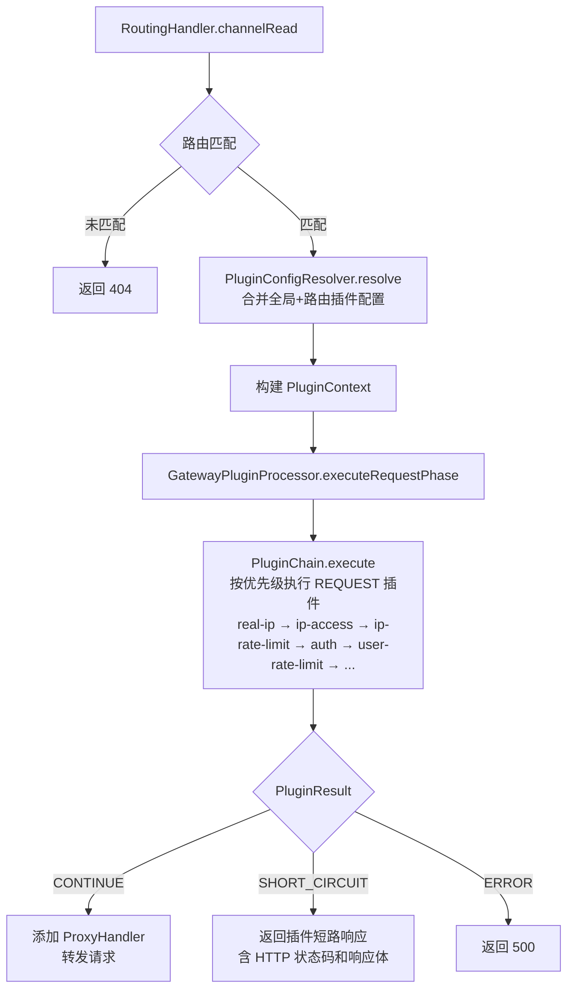
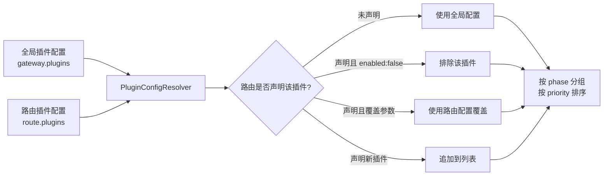

# 技术设计文档：插件系统

## 概述

为 netty-gateway 构建通用插件系统，参考 APISIX 插件模型。插件覆盖请求生命周期的四个阶段（REQUEST、PROXY、RESPONSE、ERROR），支持全局 + 路由级编排，通过 YAML 声明式配置管理。

本 spec 包含：Plugin 接口、PluginPhase 枚举、PluginResult、PluginContext、PluginChain 执行链、PluginConfig 配置模型、PluginRegistry 注册表、PluginConfigResolver 配置合并、GatewayPluginProcessor 集成到 RoutingHandler、现有 SecurityFilter 迁移为 REQUEST 阶段插件。GatewayPluginProcessor 完全替代 GatewaySecurityProcessor，不做并行共存。

核心设计决策：
- 插件接口采用同步执行模型（与现有 SecurityFilter 一致），在 Netty EventLoop 线程上执行，插件实现不得阻塞
- 插件配置复用现有全局默认 + 路由级覆盖的合并模式（与 RouteSecurityConfigResolver 一致）
- GatewayPluginProcessor 在本阶段处理 REQUEST 阶段，PROXY/RESPONSE/ERROR 阶段的集成点预留接口但不在本 spec 实现调用方
- PluginConfigResolver 从 PluginRegistry 查询插件的 phase 信息来分组排序（phase 是插件固有属性，不在 YAML 中配置）
- 插件执行耗时指标记录放在 PluginChain 内部（每个插件执行前后计时），更精确
- 插件相关代码放在 `com.lei.gateway.core.plugin` 包，配置类放在 `com.lei.gateway.core.config`
- 现有 5 个 SecurityFilter 迁移为 REQUEST 阶段插件后，GatewaySecurityProcessor 及相关类全部删除

## 架构

### 插件系统在 Pipeline 中的位置

```
Client ──HTTP/1.1──▶ Netty Server
                    ChannelPipeline
                         │
                    ┌──────────────────────────┐
                    │ HttpServerCodec            │
                    │ IdleStateHandler           │
                    │ TraceContextHandler         │
                    │ DrainHandler               │
                    │ RoutingHandler              │  ← REQUEST 阶段插件在此执行
                    │   └─ GatewayPluginProcessor │  ← 完全替代 GatewaySecurityProcessor
                    │ ProxyHandler               │  ← PROXY/RESPONSE/ERROR 阶段（预留）
                    └──────────────────────────┘
```

### REQUEST 阶段执行流程



### 插件配置合并流程



## 组件与接口

### 1. PluginPhase（插件执行阶段枚举）

```java
package com.lei.gateway.core.plugin;

public enum PluginPhase {
    REQUEST,
    PROXY,
    RESPONSE,
    ERROR
}
```

### 2. Plugin（插件接口）

```java
package com.lei.gateway.core.plugin;

public interface Plugin {

    /** 插件唯一名称，非空非 blank。 */
    String name();

    /** 插件所属执行阶段。 */
    PluginPhase phase();

    /** 默认优先级，数值越小优先级越高。 */
    int defaultPriority();

    /** 执行插件逻辑。 */
    PluginResult execute(PluginContext context, PluginConfig config);
}
```

### 3. PluginResult（插件执行结果）

```java
package com.lei.gateway.core.plugin;

import io.netty.handler.codec.http.HttpResponseStatus;

public class PluginResult {

    private final PluginResultType type;
    private final HttpResponseStatus status;
    private final String body;
    private final String pluginName;         // SHORT_CIRCUIT 时记录哪个插件拒绝
    private final String reason;             // 拒绝原因（用于访问日志）
    private final Integer retryAfterSeconds; // 限流时的 Retry-After

    // 工厂方法
    public static PluginResult doContinue();
    public static PluginResult shortCircuit(HttpResponseStatus status, String body,
            String pluginName, String reason, Integer retryAfterSeconds);
    public static PluginResult error(HttpResponseStatus status, String body);

    public boolean isContinue();
}
```

PluginResultType 枚举：

```java
package com.lei.gateway.core.plugin;

public enum PluginResultType {
    CONTINUE,
    SHORT_CIRCUIT,
    ERROR
}
```

### 4. PluginContext（插件执行上下文）

```java
package com.lei.gateway.core.plugin;

import com.lei.gateway.core.config.Route;
import io.netty.channel.ChannelHandlerContext;
import io.netty.handler.codec.http.HttpRequest;
import java.util.Map;

public class PluginContext {

    private final ChannelHandlerContext channelHandlerContext;
    private final HttpRequest request;
    private final Route route;
    private final String traceId;

    // 一等公民字段（兼容 SecurityRequestContext 契约）
    private String clientIp;
    private String userId;

    // 可变 KV 属性存储（插件间共享数据）
    private final Map<String, Object> attributes;

    // 插件追踪标签
    private final Map<String, String> traceTags;

    // getter/setter 省略
    public void setAttribute(String key, Object value);
    public <T> T getAttribute(String key, Class<T> type);
    public void putTraceTag(String key, String value);
    public Map<String, String> getTraceTags();
}
```

设计要点：
- `clientIp` 和 `userId` 作为一等公民字段，与现有 `SecurityRequestContext` 契约保持一致，便于后续 SecurityFilter 迁移为插件时无缝对接
- `attributes` 使用 `HashMap<String, Object>`，在单个请求生命周期内共享，不需要线程安全（Netty EventLoop 单线程模型）
- `traceTags` 与现有 `SecurityRequestContext.traceTags` 模式一致

### 5. PluginConfig（插件实例配置）

```java
package com.lei.gateway.core.plugin;

import java.util.Map;

public class PluginConfig {

    private final String pluginName;
    private final boolean enabled;
    private final int priority;
    private final Map<String, Object> config;

    // 构造函数、getter 省略
}
```

### 6. PluginChain（插件执行链）

```java
package com.lei.gateway.core.plugin;

import com.lei.gateway.core.observability.MetricsCollector;
import java.util.List;

public class PluginChain {

    private final MetricsCollector metricsCollector;

    /**
     * 按优先级顺序执行插件列表。
     *
     * <p>内部为每个插件记录执行耗时和决策指标。
     *
     * @param plugins 已排序的插件列表（priority 升序）
     * @param configs 插件名 → PluginConfig 映射
     * @param context 插件执行上下文
     * @param routeId 路由 ID（用于指标 tag）
     * @return 最终执行结果
     */
    public PluginResult execute(List<Plugin> plugins,
            Map<String, PluginConfig> configs,
            PluginContext context, String routeId);
}
```

执行逻辑：
1. 遍历 plugins 列表（已按 priority 升序排列）
2. 对每个插件：记录开始时间 → 调用 `plugin.execute(context, config)` → 记录耗时指标 `metricsCollector.recordPluginDuration(pluginName, routeId, durationNanos)` → 记录决策指标 `metricsCollector.recordPluginDecision(pluginName, decision, routeId)` → 写入 `context.putTraceTag(pluginName, decision)`
3. 如果返回 `CONTINUE`，继续下一个插件
4. 如果返回 `SHORT_CIRCUIT`，立即停止并返回该结果
5. 如果插件抛出异常，catch 异常，`log.error("插件执行异常 plugin={} routeId={}", pluginName, routeId, e)`，返回 `PluginResult.error(500, "Internal plugin error")`
6. 所有插件都返回 `CONTINUE` 时，返回 `PluginResult.doContinue()`

### 7. PluginRegistry（插件注册表）

```java
package com.lei.gateway.core.plugin;

import java.util.List;
import java.util.Map;
import java.util.Optional;

public class PluginRegistry {

    private final Map<String, Plugin> plugins;

    /**
     * 注册插件。同名插件重复注册抛出 IllegalStateException。
     */
    public void register(Plugin plugin);

    /**
     * 按名称查找插件。
     */
    public Optional<Plugin> find(String name);

    /**
     * 从 Spring ApplicationContext 中发现并注册所有 Plugin Bean。
     */
    public void discoverAndRegister(List<Plugin> pluginBeans);
}
```

### 8. PluginConfigResolver（插件配置解析器）

```java
package com.lei.gateway.core.plugin;

import com.lei.gateway.core.config.Route;
import java.util.List;
import java.util.Map;

public class PluginConfigResolver {

    /**
     * 合并全局插件配置与路由级覆盖，生成最终生效的插件配置列表。
     *
     * @param globalPlugins 全局插件配置
     * @param route         当前路由（含路由级插件配置）
     * @return 按 phase 分组、按 priority 排序的生效插件配置
     */
    public Map<PluginPhase, List<PluginConfig>> resolve(
            List<PluginConfigEntry> globalPlugins, Route route);
}
```

### 9. PluginConfigEntry（YAML 配置条目）

```java
package com.lei.gateway.core.config;

import java.util.Map;

public class PluginConfigEntry {

    private String name;
    private Boolean enabled;  // 默认 true
    private Integer priority; // 可选，覆盖插件默认优先级
    private Map<String, Object> config; // 插件特定参数

    // getter/setter 省略
}
```

### 10. GatewayPluginProcessor（网关插件处理器）

```java
package com.lei.gateway.core.plugin;

import com.lei.gateway.core.config.Route;
import com.lei.gateway.core.observability.MetricsCollector;
import io.netty.channel.ChannelHandlerContext;
import io.netty.handler.codec.http.HttpRequest;

public class GatewayPluginProcessor {

    private final PluginRegistry pluginRegistry;
    private final PluginConfigResolver configResolver;
    private final PluginChain pluginChain;
    private final MetricsCollector metricsCollector;
    private final List<PluginConfigEntry> globalPluginConfigs;

    /**
     * 执行 REQUEST 阶段插件链。
     *
     * @return 包含 PluginResult 和 PluginContext 的执行结果
     */
    public PluginExecutionResult executeRequestPhase(ChannelHandlerContext ctx,
            HttpRequest request, Route route, String traceId);
}
```

PluginExecutionResult 包装类：

```java
package com.lei.gateway.core.plugin;

/**
 * 插件链执行结果，包含 PluginResult 和 PluginContext。
 * RoutingHandler 需要 PluginContext 来提取 clientIp、traceTags 等写入 Channel Attribute。
 */
public class PluginExecutionResult {

    private final PluginResult result;
    private final PluginContext context;

    // 构造函数、getter 省略
    public boolean isContinue() { return result.isContinue(); }
}
```

执行流程：
1. 调用 `PluginConfigResolver.resolve()` 合并全局 + 路由配置
2. 取出 REQUEST 阶段的插件配置列表
3. 从 `PluginRegistry` 查找每个插件实例（未找到的 log.warn 并跳过）
4. 构建 `PluginContext`
5. 调用 `PluginChain.execute()` 执行插件链（内部记录每个插件的执行耗时和决策指标）
6. 返回 `PluginExecutionResult(pluginResult, pluginContext)`

### 11. 配置类变更

#### GatewayProperties 新增 plugins 字段

```java
// 在现有 GatewayProperties 中新增
private List<PluginConfigEntry> plugins = new ArrayList<>();
```

#### Route 新增 plugins 字段

```java
// 在现有 Route 中新增
private List<PluginConfigEntry> plugins;
```

### 12. RoutingContext 变更

移除 `GatewaySecurityProcessor` 字段，替换为 `GatewayPluginProcessor`：

```java
// 在现有 RoutingContext 中：
// 移除：private final GatewaySecurityProcessor securityProcessor;
// 新增：
private final GatewayPluginProcessor pluginProcessor;
```

### 13. RoutingHandler 集成变更

在路由匹配后，GatewayPluginProcessor 完全替代 GatewaySecurityProcessor：

```java
// 路由匹配成功后
PluginExecutionResult execResult = pluginProcessor.executeRequestPhase(ctx, request, route, traceId);
PluginContext pluginCtx = execResult.getContext();

// 从 PluginContext 提取安全属性写入 Channel Attribute（兼容访问日志）
attachPluginAttributes(ctx, pluginCtx);

if (!execResult.isContinue()) {
    // SHORT_CIRCUIT 或 ERROR：写访问日志 + 返回对应 HTTP 响应
    writePluginAccessLog(ctx, request, route, execResult, requestStartNanos);
    sendPluginResponse(ctx, request, execResult.getResult());
    return;
}

// 继续添加 ProxyHandler 转发请求
ProxyContext proxyCtx = new ProxyContext(...);
ProxyHandler proxyHandler = new ProxyHandler(route, proxyCtx);
// ...
```

RoutingHandler 中移除所有 `GatewaySecurityProcessor` 相关代码：
- 移除 `gatewaySecurityProcessor` 字段
- 移除 `SecurityEvaluationResult` 相关逻辑
- 移除 `attachSecurityAttributes()` 方法，替换为 `attachPluginAttributes()`
- 移除 `writeSecurityAccessLog()` 方法，替换为 `writePluginAccessLog()`
- 移除 `sendSecurityDecision()` 方法，替换为 `sendPluginResponse()`
- 移除 `determineAuthPassed()` 方法（逻辑移入 AuthPlugin）

### 14. MetricsCollector 新增方法

```java
/** 记录插件执行耗时。 */
public void recordPluginDuration(String pluginName, String routeId, long durationNanos);

/** 记录插件执行决策。 */
public void recordPluginDecision(String pluginName, String decision, String routeId);
```

指标命名：
- `gateway.plugin.duration`（Timer）— tag: plugin, routeId
- `gateway.plugin.decisions`（Counter）— tag: plugin, decision, routeId

与现有 `gateway.security.filter.duration` / `gateway.security.filter.decisions` 模式一致。

### 15. GatewayAutoConfiguration 变更

新增 Bean 注册，移除 GatewaySecurityProcessor Bean：

```java
// 移除：GatewaySecurityProcessor bean
// 移除：RouteSecurityConfigResolver bean

@Bean
public PluginRegistry pluginRegistry(List<Plugin> plugins) {
    PluginRegistry registry = new PluginRegistry();
    registry.discoverAndRegister(plugins);
    return registry;
}

@Bean
public PluginConfigResolver pluginConfigResolver(PluginRegistry pluginRegistry) {
    return new PluginConfigResolver(pluginRegistry);
}

@Bean
public GatewayPluginProcessor gatewayPluginProcessor(
        PluginRegistry pluginRegistry,
        PluginConfigResolver configResolver,
        GatewayProperties gatewayProperties,
        MetricsCollector metricsCollector) {
    return new GatewayPluginProcessor(pluginRegistry, configResolver,
            new PluginChain(metricsCollector), metricsCollector,
            gatewayProperties.getPlugins());
}

// 5 个安全插件 Bean（由 Spring 自动发现注入 PluginRegistry）
@Bean
public RealIpPlugin realIpPlugin(SecurityProperties securityProperties) { ... }

@Bean
public IpAccessPlugin ipAccessPlugin(CidrMatcher cidrMatcher) { ... }

@Bean
public IpRateLimitPlugin ipRateLimitPlugin(RateLimiterEngine rateLimiterEngine) { ... }

@Bean
public AuthPlugin authPlugin(AuthProvider authProvider) { ... }

@Bean
public UserRateLimitPlugin userRateLimitPlugin(RateLimiterEngine rateLimiterEngine) { ... }
```

RoutingContext Bean 移除 `GatewaySecurityProcessor` 参数，新增 `GatewayPluginProcessor` 参数。

### 16. SecurityFilter 迁移为 REQUEST 阶段插件

5 个现有 SecurityFilter 迁移为 Plugin 实现，放在 `com.lei.gateway.core.plugin` 包：

| 原 SecurityFilter | 新 Plugin | name | defaultPriority | 逻辑说明 |
|---|---|---|---|---|
| RealIpFilter | RealIpPlugin | `real-ip` | 1000 | 从 XFF/trustedProxies 解析真实客户端 IP，写入 `PluginContext.clientIp` |
| IpAccessFilter | IpAccessPlugin | `ip-access` | 2000 | IP 黑白名单检查，命中 deny 返回 SHORT_CIRCUIT(403)，shadow 模式只记日志 |
| IpRateLimitFilter | IpRateLimitPlugin | `ip-rate-limit` | 3000 | 按客户端 IP 限流，超限返回 SHORT_CIRCUIT(429) + Retry-After |
| AuthenticationFilter | AuthPlugin | `auth` | 4000 | JWT 认证，失败返回 SHORT_CIRCUIT(401)，成功写入 `PluginContext.userId` |
| UserRateLimitFilter | UserRateLimitPlugin | `user-rate-limit` | 5000 | 按 userId 限流，超限返回 SHORT_CIRCUIT(429) + Retry-After |

每个插件从 `PluginConfig.config` Map 中读取自己的配置参数（与原 SecurityFilter 从 EffectiveSecurityConfig 读取的参数一致）。

PluginResult 的 SHORT_CIRCUIT 携带额外信息以兼容现有行为（已在 Section 3 PluginResult 定义中包含）：
- `pluginName`：插件名称（用于访问日志的 securityFilter 字段）
- `reason`：拒绝原因（用于访问日志的 securityReason 字段）
- `retryAfterSeconds`：限流时的 Retry-After 值

### 17. Channel Attribute 兼容

RoutingHandler 现有的 Channel Attribute 写入逻辑（供访问日志使用）从 PluginContext 提取：

| Channel Attribute | 数据来源 |
|---|---|
| CLIENT_IP_KEY | `PluginContext.clientIp` |
| AUTH_REQUIRED_KEY | `PluginContext.getAttribute("authRequired")` |
| AUTH_PASSED_KEY | `PluginContext.getAttribute("authPassed")` |
| SECURITY_DECISION_KEY | 从 PluginResult.type 映射（CONTINUE→"ALLOW", SHORT_CIRCUIT→"DENY"） |
| SECURITY_FILTER_KEY | `PluginResult.pluginName` |
| SECURITY_REASON_KEY | `PluginResult.reason` |

AuthPlugin 在执行时将 `authRequired` 和 `authPassed` 写入 PluginContext.attributes。

### 19. 删除的类

迁移完成后删除以下类：
- `GatewaySecurityProcessor`（含内部类 RealIpFilter、IpAccessFilter、IpRateLimitFilter、AuthenticationFilter、UserRateLimitFilter）
- `SecurityFilter` 接口
- `SecurityRequestContext`
- `SecurityEvaluationResult`
- `SecurityDecision`
- `SecurityDecisionType`
- `RouteSecurityConfigResolver`

保留的类（被插件复用）：
- `AuthProvider` / `JwtAuthProvider` / `JwksKeyProvider`（认证逻辑，AuthPlugin 调用；`authenticate()` 接收 `HttpRequest` 而非 `SecurityRequestContext`）
- `EffectiveSecurityConfig`（Auth/Jwt/TokenExtractor/Providers 等内部类作为 AuthProvider SPI 的数据模型，被 AuthPlugin/JwtAuthProvider/JwksKeyProvider 使用）
- `CidrMatcher`（IP 匹配，IpAccessPlugin 调用）
- `ClientIpResolver`（IP 解析，RealIpPlugin 调用）
- `RateLimiterEngine` / `LocalTokenBucketRateLimiter` / `DistributedRateLimiterAdapter`（限流引擎，限流插件调用）
- `SecurityAuditLogger`（审计日志，插件调用）
- `SecurityProperties`（`AuthType` 枚举被 AuthPlugin/AuthProvider 引用）

## 数据模型

### PluginPhase（枚举）

| 值 | 说明 |
|---|---|
| REQUEST | 路由匹配后、转发前 |
| PROXY | 选择上游节点时 |
| RESPONSE | 收到上游响应时 |
| ERROR | 上游连接失败或超时时 |

### PluginResultType（枚举）

| 值 | 说明 |
|---|---|
| CONTINUE | 继续执行下一个插件 |
| SHORT_CIRCUIT | 短路终止，返回指定 HTTP 响应 |
| ERROR | 执行异常，返回 500 |

### PluginConfig（插件实例配置）

| 字段 | 类型 | 说明 |
|---|---|---|
| pluginName | String | 插件名称 |
| enabled | boolean | 是否启用，默认 true |
| priority | int | 执行优先级，数值越小越先执行 |
| config | Map\<String, Object\> | 插件特定参数 |

### PluginContext（插件执行上下文）

| 字段 | 类型 | 说明 |
|---|---|---|
| channelHandlerContext | ChannelHandlerContext | Netty channel 上下文 |
| request | HttpRequest | 当前 HTTP 请求 |
| route | Route | 匹配的路由 |
| traceId | String | 追踪 ID |
| clientIp | String | 客户端 IP（可变，由插件设置） |
| userId | String | 用户 ID（可变，由插件设置） |
| attributes | Map\<String, Object\> | 可变 KV 属性存储 |
| traceTags | Map\<String, String\> | 插件追踪标签 |

### PluginConfigEntry（YAML 配置条目）

| 字段 | 类型 | 说明 |
|---|---|---|
| name | String | 插件名称 |
| enabled | Boolean | 是否启用，null 视为 true |
| priority | Integer | 可选，覆盖插件默认优先级 |
| config | Map\<String, Object\> | 插件特定参数 |

### YAML 配置示例

```yaml
gateway:
  plugins:
    - name: real-ip
      enabled: true
    - name: ip-access
      enabled: true
      config:
        allow-list:
          - 10.0.0.0/8
        deny-list:
          - 192.168.1.100
    - name: ip-rate-limit
      enabled: true
      config:
        permits-per-second: 100
        burst-capacity: 200
    - name: auth
      enabled: true
      config:
        type: JWT
        issuer: my-issuer
    - name: user-rate-limit
      enabled: true
      config:
        permits-per-second: 50
        burst-capacity: 100

  routes:
    - id: api-service
      path-prefix: /api
      upstream: http://localhost:8081
      plugins:
        - name: ip-rate-limit
          enabled: false          # 该路由禁用全局 IP 限流
        - name: custom-header     # 路由级新增插件
          priority: 150
          config:
            header-name: X-Custom
            header-value: test
```


## Correctness Properties

*属性（Property）是指在系统所有合法执行中都应成立的特征或行为——本质上是对系统行为的形式化陈述。属性是人类可读规格说明与机器可验证正确性保证之间的桥梁。*

### Property 1: 插件链按优先级执行且全 CONTINUE 正确完成

*对于任意*同一阶段的插件列表（每个插件有随机优先级且全部返回 CONTINUE），PluginChain 执行后应满足：(a) 所有插件都被调用，(b) 调用顺序严格按 priority 升序，(c) 最终结果为 CONTINUE。

**Validates: Requirements 1.5, 3.2, 3.5, 6.4**

### Property 2: SHORT_CIRCUIT 终止后续插件执行

*对于任意*长度 N ≥ 2 的插件链和任意位置 K（1 ≤ K ≤ N），如果第 K 个插件返回 SHORT_CIRCUIT（携带随机 HTTP 状态码和响应体），则 PluginChain 应满足：(a) 第 1 到 K 个插件被调用，(b) 第 K+1 到 N 个插件未被调用，(c) 返回的 PluginResult 类型为 SHORT_CIRCUIT 且状态码和响应体与第 K 个插件返回值一致。

**Validates: Requirements 3.3**

### Property 3: 插件异常产生 ERROR 结果

*对于任意*插件链，如果某个插件在执行时抛出异常，则 PluginChain 应捕获该异常并返回类型为 ERROR、HTTP 状态码为 500 的 PluginResult，且后续插件不被执行。

**Validates: Requirements 3.4**

### Property 4: PluginContext 属性在插件间共享

*对于任意*键值对（随机 String key、随机 Object value）和任意两个插件 A、B（A 优先级高于 B），如果插件 A 通过 `setAttribute(key, value)` 设置属性，则插件 B 通过 `getAttribute(key, type)` 应能获取到相同的值。同样适用于 clientIp 和 userId 一等公民字段的 setter/getter 往返。

**Validates: Requirements 4.2, 4.3, 4.4**

### Property 5: 插件配置合并正确性

*对于任意*全局插件配置列表和任意路由级插件配置列表，PluginConfigResolver.resolve() 应满足：(a) 全局中 enabled 且路由未覆盖的插件出现在结果中，(b) 路由级同名插件的 enabled/priority/config 覆盖全局值，(c) 路由级新增插件追加到结果中，(d) enabled=false 的插件不出现在结果中，(e) 结果按 phase 分组后每组内按 priority 升序排列。

**Validates: Requirements 5.2, 5.4, 5.5, 6.1, 6.4**

### Property 6: PluginRegistry 注册查找往返

*对于任意*插件（随机唯一名称），注册到 PluginRegistry 后，通过 `find(name)` 查找应返回该插件实例；查找未注册的名称应返回 empty。

**Validates: Requirements 7.1**

### Property 7: PluginRegistry 拒绝重复名称

*对于任意*两个插件，如果它们的 name() 返回相同的字符串，则第二次 register() 调用应抛出 IllegalStateException。

**Validates: Requirements 7.4**

### Property 8: GatewayPluginProcessor 记录指标和追踪标签

*对于任意* REQUEST 阶段插件执行，GatewayPluginProcessor 应为每个执行的插件记录 `gateway.plugin.duration` Timer（tag: plugin, routeId）和 `gateway.plugin.decisions` Counter（tag: plugin, decision, routeId），且 PluginContext 的 traceTags 应包含每个插件名称对应的决策标签。

**Validates: Requirements 8.4, 8.5**

### Property 9: 安全插件行为等价性

*对于任意*合法的 HTTP 请求（任意 method、URI、headers）和任意安全配置组合（IP 黑白名单、限流参数、JWT token），5 个安全插件（real-ip、ip-access、ip-rate-limit、auth、user-rate-limit）通过 PluginChain 执行后产生的最终决策（CONTINUE 或 SHORT_CIRCUIT 及其状态码）应与原 GatewaySecurityProcessor 对相同输入产生的 SecurityDecision 等价。

**Validates: Requirements 9.6**

## 错误处理

| 场景 | 状态码 | 处理方式 |
|---|---|---|
| 插件执行抛出异常 | 500 | PluginChain 捕获异常，`log.error("插件执行异常 plugin={} routeId={}", name, routeId, e)`，返回 ERROR 结果 |
| 插件配置引用不存在的插件名 | — | PluginRegistry 查找失败时 `log.warn("插件未注册: {}", name)`，跳过该插件，不中断请求 |
| 重复注册同名插件 | — | 启动时抛出 IllegalStateException，阻止应用启动 |
| REQUEST 阶段返回 SHORT_CIRCUIT | 插件指定 | RoutingHandler 发送插件指定的 HTTP 状态码和响应体，不继续安全检查和转发 |
| REQUEST 阶段返回 ERROR | 500 | RoutingHandler 返回 500 Internal Server Error |
| 插件配置 YAML 解析失败 | — | Spring Boot 配置绑定失败，应用启动失败（标准行为） |

关键原则：
- 所有异常日志必须传递异常对象：`log.error("msg", e)`
- 插件执行异常不应导致整个请求处理链崩溃，PluginChain 负责兜底
- 配置错误（如引用不存在的插件）采用 warn + skip 策略，不阻断请求
- 安全插件的 shadow 模式行为与原 SecurityFilter 一致：命中规则只记日志不拦截（返回 CONTINUE 而非 SHORT_CIRCUIT）

## 测试策略

### 属性测试（Property-Based Testing）

使用 jqwik 作为属性测试库，每个属性测试最少 100 次迭代。

每个正确性属性对应一个属性测试，测试文件命名为 `*PropertyTest.java`，放在与源码同包路径下。

标签格式：`// Feature: plugin-system, Property {number}: {property_text}`

属性测试覆盖：
- Property 1-3：PluginChain 执行逻辑（优先级排序、CONTINUE/SHORT_CIRCUIT/ERROR 行为）
- Property 4：PluginContext 属性共享
- Property 5：PluginConfigResolver 合并逻辑
- Property 6-7：PluginRegistry 注册/查找/重复检测
- Property 8：GatewayPluginProcessor 指标和追踪标签
- Property 9：安全插件行为等价性

### 单元测试

单元测试覆盖具体示例和边缘情况：
- PluginPhase 枚举值验证（恰好 4 个值）
- PluginResult 工厂方法验证（含新增的 pluginName/reason/retryAfterSeconds 字段）
- PluginContext 构造和字段访问
- PluginConfigEntry 默认值（enabled 默认 true）
- PluginConfigResolver 边缘情况：路由无插件配置时使用全局配置、路由 enabled:false 排除全局插件
- PluginRegistry 边缘情况：查找不存在的插件返回 empty
- GatewayProperties / Route 新增 plugins 字段的配置绑定
- RealIpPlugin：XFF 解析、trustedProxies 模式、trustedProxyHops 模式
- IpAccessPlugin：黑名单优先于白名单、shadow 模式、fail-closed
- IpRateLimitPlugin：超限返回 429 + Retry-After、shadow 模式
- AuthPlugin：JWT 验证成功写入 userId、验证失败返回 401、shadow 模式
- UserRateLimitPlugin：按 userId 限流、未认证时跳过

### 集成测试

集成测试验证端到端流程：
- RoutingHandler 在路由匹配后调用 GatewayPluginProcessor（不再调用 GatewaySecurityProcessor）
- REQUEST 阶段 SHORT_CIRCUIT 时 RoutingHandler 返回对应 HTTP 响应
- REQUEST 阶段 CONTINUE 时继续转发
- 安全插件链端到端：IP 黑名单拦截、JWT 认证失败、限流触发
- 访问日志中 securityFilter/securityReason/authRequired/authPassed 字段正确输出

### 测试配置

```java
// jqwik 属性测试示例
@Property(tries = 100)
// Feature: plugin-system, Property 1: 插件链按优先级执行且全 CONTINUE 正确完成
void pluginChainExecutesInPriorityOrder(@ForAll List<@IntRange(min = 0, max = 1000) Integer> priorities) {
    // 生成随机优先级的插件列表，验证执行顺序
}
```
