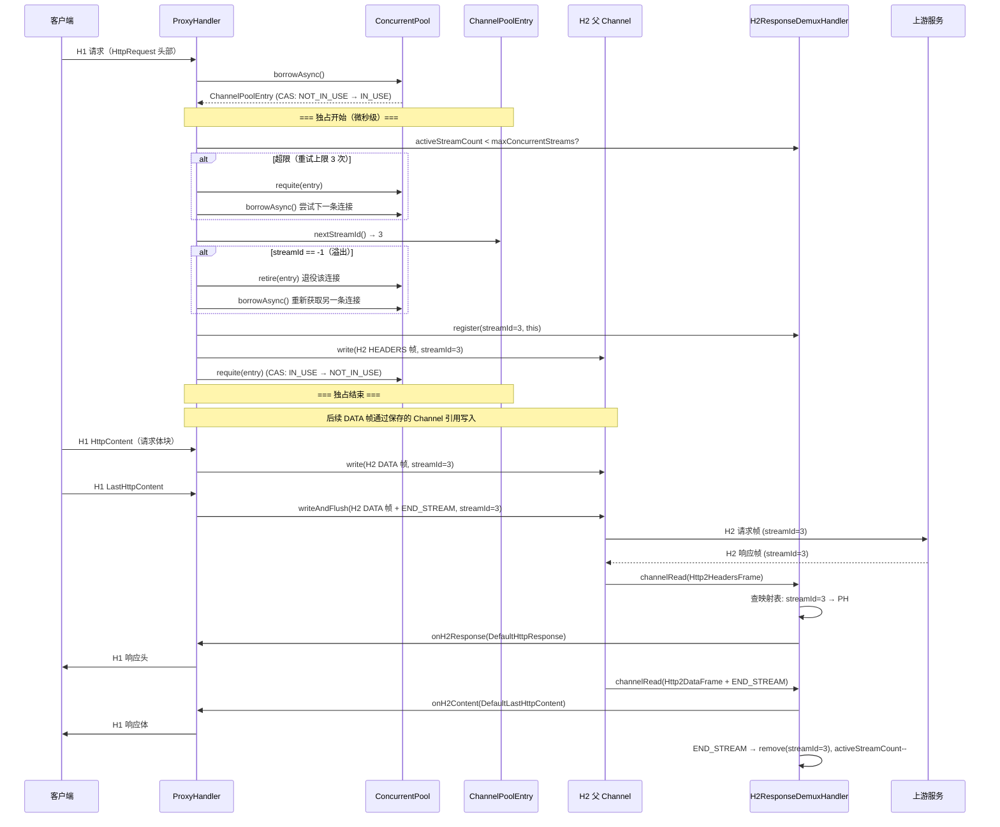
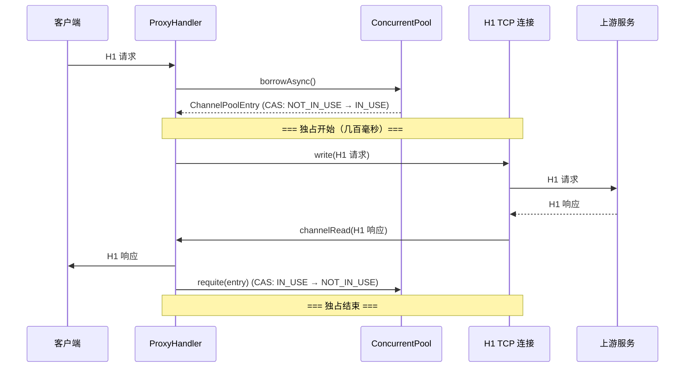

# Design Document: upstream-h2-connection

## Overview

将网关到上游服务的连接协议从 HTTP/1.1 升级为 HTTP/2（h2c 明文），核心思路来自博客作者 dreamlike-ocean 的实现方案：**ConcurrentPool 几乎不改，通过缩短 H2 下连接的独占时间来实现高并发**。

### H1 vs H2 的关键差异

在 H1 模式下，ProxyHandler borrow 一条连接后，需要独占它直到整个请求-响应周期完成（几百毫秒），然后才 requite 归还。50 条连接 = 最大 50 并发。

在 H2 模式下，ProxyHandler borrow 一条连接后，只需要做三件事：检查 MAX_CONCURRENT_STREAMS → 自增 streamId → write HEADERS 帧，然后立即 requite 归还。这个独占时间是微秒级的。后续 DATA 帧（请求体）通过保存的 Channel 引用直接写入（Netty Channel.write 线程安全，无需独占）。响应不再通过持有连接来等待，而是通过 streamId 映射表关联回来。5 条连接即可支撑远超 H1 50 条连接的并发量。

### 为什么 ConcurrentPool 几乎不需要改

ConcurrentPool 的设计本质是"独占式资源池"——borrow 时 CAS 抢占，requite 时归还。这个模型在 H2 下依然完美适用，因为：

1. **borrow 语义不变**：获取一条 H2 父 Channel 的独占权
2. **requite 语义不变**：归还独占权，让其他请求可以使用
3. **独占时间极短**：H2 下只需要独占"检查流控 + 自增 streamId + write HEADERS 帧"的时间（微秒级），而不是整个请求生命周期
4. **三级获取策略依然有效**：ThreadLocal 快速路径在 EventLoop 线程模型下命中率很高，因为同一个 EventLoop 线程会频繁 borrow/requite 同一条连接

唯一新增的是 `retire()` 方法：与 `remove()` 相同的摘除逻辑（CAS→REMOVED、从列表移除、计数减一），但不调用 `entry.close()`。这是通用的池操作语义（"退役但延迟关闭"），用于 GOAWAY 和 streamId 溢出等场景。

### HTTP/2 协议基础

HTTP/2 是一个二进制分帧协议，在单条 TCP 连接上通过 stream 多路复用多个请求/响应：

- **帧（Frame）**：H2 通信的最小单位。每个帧有一个 stream ID 字段，标识它属于哪个 stream。主要帧类型：
  - **HEADERS 帧**：携带请求/响应头，相当于 H1 的请求行 + 头部
  - **DATA 帧**：携带请求/响应体，相当于 H1 的 body
  - **GOAWAY 帧**：通知对端不再接受新 stream
  - **RST_STREAM 帧**：立即终止单个 stream
  - **SETTINGS 帧**：协商连接参数（包括 MAX_CONCURRENT_STREAMS）
  - **PING 帧**：连接活性检测
- **Stream**：一对请求/响应的逻辑通道，由 stream ID 标识。客户端发起的 stream ID 为奇数（1, 3, 5, ...），上限 2^31 - 1
- **MAX_CONCURRENT_STREAMS**：SETTINGS 参数，服务端告知单条连接允许的最大并发 stream 数（Nginx 默认 128，Go 默认 250）。超限发送新 stream 会被 RST_STREAM（REFUSED_STREAM）
- **END_STREAM 标志**：帧上的一个 flag，表示该方向的数据传输结束
- **h2c（HTTP/2 Cleartext）**：不使用 TLS 的 HTTP/2，适用于内网。本方案使用 prior knowledge 模式，客户端直接发送 H2 Connection Preface（24 字节的 magic），不经过 H1 Upgrade 协商
- **Connection Preface**：H2 连接建立时客户端发送的 24 字节 magic 字符串 `PRI * HTTP/2.0\r\n\r\nSM\r\n\r\n`，后跟一个 SETTINGS 帧。服务端收到后回复自己的 SETTINGS 帧，完成握手

### 设计决策总结

| 决策项 | 选择 | 理由 |
|---|---|---|
| ConcurrentPool | 新增 retire() | CAS 独占模型不变，retire() 提供"从池中摘除但不关闭资源"的通用语义 |
| PoolEntry / PoolConfig | 零改动 | 无需新增状态 |
| 连接池返回对象 | H2 父 Channel | 不用 stream 子 Channel 模型 |
| 响应关联方式 | streamId → ProxyHandler 映射表 | 安装在 H2 父 Channel 上 |
| H1 → H2 转换 | 手动构造 H2 帧 | 精确控制 streamId 和帧内容 |
| H2 → H1 转换 | 手动转换 Http2HeadersFrame/Http2DataFrame | Http2FrameCodec 解码为帧对象，H2ResponseDemuxHandler 手动转为 H1 对象 |
| 建连模式 | Prior Knowledge（h2c） | 内网场景，省去 Upgrade RTT |
| H2 专用配置 | 不新增 | 复用现有 maxConnectionsPerHost 等字段 |
| Http2MultiplexHandler | 不使用 | 本方案不使用 stream 子 Channel 模型，只需 Http2FrameCodec 解码帧 |
| MAX_CONCURRENT_STREAMS | ProxyHandler 层检查 | 不修改 ConcurrentPool 的 borrow 逻辑，保持池的通用性 |
| 请求体写入时机 | requite 后通过 Channel 引用直接写 | Netty Channel.write 线程安全，无需独占；避免大 body 延长独占时间 |
| streamId 溢出 | retire 连接，重新 borrow | 溢出后该连接不能再创建新 stream（H2 规范），退役让池自动创建新连接 |

## Architecture

### H2 下的请求处理时序



### 对比：H1 下的请求处理时序



### 改动范围

```
gateway-pool/
  └── ConcurrentPool           → 新增 retire() 方法（从池中摘除但不关闭资源）
gateway-core/
  ├── proxy/
  │   ├── ChannelPoolEntryFactory  → 重写：H1 pipeline → H2 pipeline（无 Http2MultiplexHandler）
  │   ├── ChannelPoolEntry         → 新增：streamId 自增器（含溢出检测）
  │   ├── H2ResponseDemuxHandler   → 新增：H2 响应分发器（非 @Sharable，每连接一个实例）
  │   ├── ProxyHandler             → 改写：borrow→流控检查→write HEADERS→requite→异步写 DATA
  │   ├── UpstreamConnectionPool   → 小改：acquire/release/remove 适配，新增 retire()
  │   └── ShutdownCoordinator      → 小改：遍历连接检查映射表，等待清空
  └── config/
      └── ConnectionPoolProperties → 零改动
gateway-example/
  └── application.yml              → 加 server.http2.enabled: true
```

## Components and Interfaces

### 1. ChannelPoolEntry（改动）

新增 streamId 自增器（含溢出检测），其余不变。

```java
public class ChannelPoolEntry implements PoolEntry {
    // ... 现有字段不变 ...

    // 新增：H2 stream ID 自增器
    // 客户端 stream ID 为奇数：1, 3, 5, ...
    // 初始值为 -1，每次 addAndGet(2) 得到 1, 3, 5, ...
    private final AtomicInteger streamIdGenerator = new AtomicInteger(-1);

    /**
     * 分配下一个 stream ID（奇数）。
     * 线程安全，可在 borrow 独占期间调用。
     *
     * @return 下一个奇数 stream ID；如果溢出（超过 Integer.MAX_VALUE）返回 -1，
     *         调用方收到 -1 后应 retire 该连接并重新 borrow 另一条
     */
    public int nextStreamId() {
        int id = streamIdGenerator.addAndGet(2);
        if (id < 0) {
            // 溢出：Integer.MAX_VALUE + 2 变为负数
            return -1;
        }
        return id;
    }
}
```

### 2. ChannelPoolEntryFactory（重写）

将 H1 pipeline（HttpClientCodec）替换为 H2 pipeline。不使用 Http2MultiplexHandler。

```java
public class ChannelPoolEntryFactory implements PoolEntryFactory<ChannelPoolEntry> {

    // 构造函数参数不变：host, port, workerGroup, channelClass, connectTimeoutMillis

    // pipeline 变更：
    // H1: HttpClientCodec
    // H2: Http2FrameCodec + H2ResponseDemuxHandler

    @Override
    protected void initChannel(SocketChannel ch) {
        Http2FrameCodec frameCodec = Http2FrameCodecBuilder.forClient()
                .initialSettings(Http2Settings.defaultSettings())
                .build();

        // 不使用 Http2MultiplexHandler——本方案不使用 stream 子 Channel 模型，
        // 由 H2ResponseDemuxHandler 直接处理 Http2FrameCodec 解码出的帧对象
        ch.pipeline().addLast(frameCodec);
        ch.pipeline().addLast(new H2ResponseDemuxHandler(upstreamConnectionPool));
    }
}
```

### 3. H2ResponseDemuxHandler（新增）

安装在 H2 父 Channel pipeline 上的响应分发器。这是整个方案的核心组件。

**非 @Sharable**：每个 H2 父 Channel 创建一个独立实例，持有自己的映射表和流控状态。多个 ProxyHandler 会并发访问同一个实例的映射表，用 ConcurrentHashMap 保证线程安全。

```java
public class H2ResponseDemuxHandler extends ChannelInboundHandlerAdapter {

    private final UpstreamConnectionPool connectionPool;

    // streamId → ProxyHandler 映射表
    private final ConcurrentHashMap<Integer, ProxyHandler> streamHandlers = new ConcurrentHashMap<>();

    // MAX_CONCURRENT_STREAMS 流控
    private volatile int maxConcurrentStreams = Integer.MAX_VALUE; // 从 SETTINGS 帧更新
    private final AtomicInteger activeStreamCount = new AtomicInteger(0);

    // GOAWAY 状态
    private volatile boolean goawayReceived;
    private volatile int lastStreamId = Integer.MAX_VALUE; // GOAWAY 中的 lastStreamId

    /**
     * 检查是否可以在此连接上创建新 stream。
     * 在 borrow 独占期间调用。
     */
    public boolean canCreateStream() {
        return activeStreamCount.get() < maxConcurrentStreams;
    }

    /**
     * 注册 streamId 到 ProxyHandler 的映射，同时递增活跃计数。
     */
    public void register(int streamId, ProxyHandler handler) {
        streamHandlers.put(streamId, handler);
        activeStreamCount.incrementAndGet();
    }

    /**
     * 移除 streamId 映射，递减活跃计数。
     * 如果 goawayReceived 且映射表为空，关闭连接。
     */
    public ProxyHandler remove(int streamId) {
        ProxyHandler handler = streamHandlers.remove(streamId);
        if (handler != null) {
            int remaining = activeStreamCount.decrementAndGet();
            if (goawayReceived && remaining == 0) {
                // 所有存量 stream 已完成，关闭连接
                ctx.channel().close();
            }
        }
        return handler;
    }

    /** 映射表是否有活跃 stream（停机时检查）。 */
    public boolean hasActiveStreams() {
        return activeStreamCount.get() > 0;
    }

    /** 获取活跃 stream 数量。 */
    public int activeStreamCount() {
        return activeStreamCount.get();
    }

    @Override
    public void channelRead(ChannelHandlerContext ctx, Object msg) {
        if (msg instanceof Http2SettingsFrame settingsFrame) {
            // 更新 MAX_CONCURRENT_STREAMS
            Long maxStreams = settingsFrame.settings().maxConcurrentStreams();
            if (maxStreams != null) {
                this.maxConcurrentStreams = maxStreams.intValue();
            }
            return;
        }

        if (msg instanceof Http2GoAwayFrame goAwayFrame) {
            handleGoAway(ctx, goAwayFrame);
            return;
        }

        if (msg instanceof Http2HeadersFrame headersFrame) {
            int streamId = headersFrame.stream().id();
            ProxyHandler handler = streamHandlers.get(streamId);
            if (handler == null) {
                // 映射表中无对应条目（可能客户端已断开），丢弃
                return;
            }
            // Http2HeadersFrame → DefaultHttpResponse
            HttpResponse response = convertHeaders(headersFrame);
            handler.onH2Response(response);
            if (headersFrame.isEndStream()) {
                handler.onH2Content(LastHttpContent.EMPTY_LAST_CONTENT);
                remove(streamId);
            }
            return;
        }

        if (msg instanceof Http2DataFrame dataFrame) {
            int streamId = dataFrame.stream().id();
            ProxyHandler handler = streamHandlers.get(streamId);
            if (handler == null) {
                dataFrame.release();
                return;
            }
            if (dataFrame.isEndStream()) {
                handler.onH2Content(new DefaultLastHttpContent(dataFrame.content()));
                remove(streamId);
            } else {
                handler.onH2Content(new DefaultHttpContent(dataFrame.content()));
            }
            return;
        }

        if (msg instanceof Http2ResetFrame resetFrame) {
            int streamId = resetFrame.stream().id();
            ProxyHandler handler = remove(streamId);
            if (handler != null) {
                handler.onH2Error(new Http2StreamResetException(resetFrame.errorCode()));
            }
            return;
        }

        ctx.fireChannelRead(msg);
    }

    private void handleGoAway(ChannelHandlerContext ctx, Http2GoAwayFrame frame) {
        this.goawayReceived = true;
        this.lastStreamId = frame.lastStreamId();

        // 从池中摘除但不关闭（存量 stream 继续处理）
        connectionPool.retire(ctx.channel());

        // streamId > lastStreamId 的 stream 触发 502
        streamHandlers.forEach((streamId, handler) -> {
            if (streamId > lastStreamId) {
                handler.onH2Error(new GoAwayException(frame.errorCode(), lastStreamId));
                remove(streamId);
            }
        });

        // 如果映射表已空，立即关闭
        if (activeStreamCount.get() == 0) {
            ctx.channel().close();
        }
    }

    @Override
    public void channelInactive(ChannelHandlerContext ctx) {
        // 连接断开：遍历映射表，对所有未完成的 stream 触发 502
        streamHandlers.forEach((streamId, handler) -> {
            handler.onH2Error(new ChannelClosedException("H2 connection closed"));
        });
        streamHandlers.clear();
        activeStreamCount.set(0);
        ctx.fireChannelInactive();
    }
}
```

### 4. ProxyHandler（改写）

H2 下的核心流程变化：

```
H1 流程：borrow → 安装 UpstreamResponseHandler → write 请求 → 等待响应 → requite
H2 流程：borrow → 流控检查 → nextStreamId（含溢出检查）→ register 映射 → write HEADERS → requite → DATA 帧异步写入 → 响应通过映射表回来
```

关键改动点：

```java
public class ProxyHandler extends ChannelInboundHandlerAdapter {
    // 移除：private Channel upstreamChannel（不再持有连接等待响应）
    // 新增：
    private int streamId;                          // 当前请求的 stream ID
    private Channel h2Channel;                     // 保存 H2 父 Channel 引用，用于 requite 后写 DATA 帧
    private H2ResponseDemuxHandler demuxHandler;   // 用于注册/移除映射
    private ChannelHandlerContext clientCtx;        // 保存客户端上下文，供响应回调使用

    // 流控重试上限，防止所有连接都满时无限循环 borrow
    private static final int MAX_ACQUIRE_RETRIES = 3;
    private int acquireRetryCount;

    private void onAcquireComplete(ChannelPoolEntry entry) {
        Channel channel = entry.getChannel();
        H2ResponseDemuxHandler demux = channel.pipeline().get(H2ResponseDemuxHandler.class);

        // 1. MAX_CONCURRENT_STREAMS 流控检查
        //    不通过就 requite，再 borrow 下一条试。
        //    所有连接都满时（重试耗尽）返回 503。
        if (!demux.canCreateStream()) {
            connectionPool.release(channel);
            if (++acquireRetryCount > MAX_ACQUIRE_RETRIES) {
                sendErrorResponse(clientCtx, HttpResponseStatus.SERVICE_UNAVAILABLE);
                return;
            }
            connectionPool.acquire(this::onAcquireComplete);
            return;
        }

        // 2. 分配 streamId（含溢出检查）
        int sid = entry.nextStreamId();
        if (sid == -1) {
            // streamId 溢出，retire 该连接，重新 borrow
            connectionPool.retire(channel);
            connectionPool.acquire(this::onAcquireComplete);
            return;
        }

        // 3. 保存引用（requite 后仍需写 DATA 帧和接收响应回调）
        this.streamId = sid;
        this.h2Channel = channel;
        this.demuxHandler = demux;

        // 4. 注册映射
        demux.register(sid, this);

        // 5. 构造并写入 H2 HEADERS 帧
        Http2Headers headers = convertToH2Headers(request);
        boolean endStream = (pendingContent == null || pendingContent.isEmpty())
                && request instanceof FullHttpRequest;
        DefaultHttp2HeadersFrame headersFrame = new DefaultHttp2HeadersFrame(headers, endStream);
        channel.write(headersFrame);

        // 6. 立即归还连接（独占结束）
        connectionPool.release(channel);

        // 7. 如果有缓冲的请求体，通过保存的 Channel 引用写入 DATA 帧
        if (!endStream) {
            flushPendingContent();
        }
    }

    /**
     * 客户端后续到达的 HttpContent，转换为 H2 DATA 帧写入。
     * 此时连接已归还，通过 h2Channel 引用直接写入（Channel.write 线程安全）。
     */
    @Override
    public void channelRead(ChannelHandlerContext ctx, Object msg) {
        if (msg instanceof HttpContent content) {
            boolean endStream = content instanceof LastHttpContent;
            DefaultHttp2DataFrame dataFrame = new DefaultHttp2DataFrame(
                    content.content().retain(), endStream);
            if (endStream) {
                h2Channel.writeAndFlush(dataFrame);
            } else {
                h2Channel.write(dataFrame);
            }
            return;
        }
        // ... 其他处理
    }

    // 被 H2ResponseDemuxHandler 回调的方法
    void onH2Response(HttpResponse response) {
        clientCtx.write(response);
    }

    void onH2Content(HttpContent content) {
        if (content instanceof LastHttpContent) {
            clientCtx.writeAndFlush(content);
            cleanup();
        } else {
            clientCtx.write(content);
        }
    }

    void onH2Error(Throwable cause) {
        sendErrorResponse(clientCtx, HttpResponseStatus.BAD_GATEWAY);
        cleanup();
    }

    private void cleanup() {
        // 从映射表移除（如果尚未移除）
        if (demuxHandler != null && streamId > 0) {
            demuxHandler.remove(streamId);
        }
    }
}
```

### 5. ConcurrentPool.retire()（新增）

从池中摘除条目但不关闭资源，由调用方决定关闭时机。与 `remove()` 的唯一区别是不调用 `entry.close()`。

```java
public void retire(T entry) {
    if (!entry.compareAndSet(PoolEntry.STATE_IN_USE, PoolEntry.STATE_REMOVED)
            && !entry.compareAndSet(PoolEntry.STATE_NOT_IN_USE, PoolEntry.STATE_REMOVED)) {
        return;
    }
    sharedList.remove(entry);
    totalEntries.decrementAndGet();
    threadLocalList.get().removeIf(ref -> ref.get() == entry);
    // 不调用 entry.close()，由调用方决定关闭时机
}
```

### 6. UpstreamConnectionPool（小改）

acquire/release/remove 的语义不变，新增 retire()：

- `acquire()` 返回的 Channel 是 H2 父 Channel
- `release()` 不再需要移除 pipeline 上的 handler（H2ResponseDemuxHandler 是常驻的）
- `remove()` 需要触发 H2ResponseDemuxHandler 的清理逻辑
- `retire(Channel)` 新增：调用 ConcurrentPool.retire() 从池中摘除连接但不关闭

```java
public void retire(Channel channel) {
    ChannelPoolEntry entry = channel.attr(ChannelPoolEntry.POOL_ENTRY_KEY).get();
    if (entry == null) {
        log.warn("退役连接时未找到关联的 PoolEntry: {}", channel);
        return;
    }
    String key = entry.getPoolKey();
    ConcurrentPool<ChannelPoolEntry> pool = pools.get(key);
    if (pool == null) {
        log.warn("退役连接时未找到对应的连接池: {}", key);
        return;
    }
    pool.retire(entry);
}
```

### 7. H1 → H2 请求转换

ProxyHandler 需要将 H1 请求转换为 H2 帧：

```
H1 HttpRequest（请求头）→ H2 HEADERS 帧
  - 伪头部：:method, :path, :scheme(http), :authority
  - 普通头部：直接映射（去掉 H1 特有的 hop-by-hop 头：Connection, Transfer-Encoding, Keep-Alive, Proxy-Connection, Upgrade）
  - 如果没有 body（FullHttpRequest 且 content 为空），HEADERS 帧带 END_STREAM 标志

H1 HttpContent（请求体块）→ H2 DATA 帧（requite 后通过 Channel 引用写入）
  - 逐块转换，每个 HttpContent → 一个 DATA 帧
  - LastHttpContent → DATA 帧带 END_STREAM 标志
```

### 8. H2 → H1 响应转换

H2ResponseDemuxHandler 接收 Http2FrameCodec 解码出的帧对象，手动转换为 H1 对象：

```
Http2HeadersFrame（响应头）→ H1 DefaultHttpResponse
  - :status 伪头部 → HTTP 状态码
  - 普通头部：直接映射（去除以 : 开头的伪头部）
  - 如果 HEADERS 帧带 END_STREAM，额外发送 LastHttpContent.EMPTY_LAST_CONTENT

Http2DataFrame（响应体）→ H1 HttpContent / LastHttpContent
  - DATA 帧不带 END_STREAM → DefaultHttpContent
  - DATA 帧带 END_STREAM → DefaultLastHttpContent
```

## Data Models

### ChannelPoolEntry 扩展

```
ChannelPoolEntry
├── channel: Channel              (现有，H2 父 Channel)
├── poolKey: String               (现有，host:port)
├── state: volatile int           (现有，NOT_IN_USE/IN_USE/REMOVED)
├── lastAccessTime: volatile long (现有)
└── streamIdGenerator: AtomicInteger (新增，初始值 -1，步长 2，溢出返回 -1)
```

### H2ResponseDemuxHandler 状态

```
H2ResponseDemuxHandler (每个 H2 父 Channel 一个实例，非 @Sharable)
├── connectionPool: UpstreamConnectionPool (引用，用于 retire)
├── maxConcurrentStreams: volatile int      (从 SETTINGS 帧更新，默认 Integer.MAX_VALUE)
├── activeStreamCount: AtomicInteger        (register +1, remove -1)
├── goawayReceived: volatile boolean        (收到 GOAWAY 后置 true)
├── lastStreamId: volatile int              (GOAWAY 中的 lastStreamId，默认 Integer.MAX_VALUE)
└── streamHandlers: ConcurrentHashMap<Integer, ProxyHandler>
    ├── key: streamId (奇数: 1, 3, 5, ...)
    └── value: ProxyHandler (处理该 stream 响应的处理器)
```

### H2 父 Channel Pipeline

```
H2 父 Channel Pipeline:
├── Http2FrameCodec        — H2 帧编解码（Netty 内置），解码为 Http2HeadersFrame/Http2DataFrame 等帧对象
└── H2ResponseDemuxHandler — 响应分发 + 流控（自定义，持有 streamId → ProxyHandler 映射表 + activeStreamCount）
```

### ProxyHandler 状态变化

```
H1 模式下的 ProxyHandler 状态：
├── upstreamChannel: Channel        (持有，直到响应完成)
├── connectingToUpstream: boolean   (连接中标记)
└── pendingContent: Queue           (缓冲请求体)

H2 模式下的 ProxyHandler 状态：
├── streamId: int                   (当前请求的 stream ID)
├── h2Channel: Channel              (保存 H2 父 Channel 引用，requite 后用于写 DATA 帧和接收回调)
├── demuxHandler: H2ResponseDemuxHandler (用于注册/移除映射、流控检查)
├── clientCtx: ChannelHandlerContext (保存客户端上下文，供响应回调使用)
├── connectingToUpstream: boolean   (连接中标记，独占期间)
└── pendingContent: Queue           (缓冲请求体，borrow 前到达的 HttpContent)
```

### 配置模型（零改动）

```
ConnectionPoolProperties (gateway.connection-pool)
├── maxConnectionsPerHost: int     = 5   (H2 多路复用下 5 条连接即可支撑高并发)
├── maxIdleTimeSeconds: int        = 60
├── slowConnectThresholdMillis: int = 10
├── connectTimeoutMillis: int      = 100
└── threadLocalCacheSize: int      = 32
```

## Correctness Properties

*A property is a characteristic or behavior that should hold true across all valid executions of a system—essentially, a formal statement about what the system should do. Properties serve as the bridge between human-readable specifications and machine-verifiable correctness guarantees.*

### Property 1: StreamId 不变量——始终为正奇数且严格递增

*For any* ChannelPoolEntry 实例，连续调用 `nextStreamId()` N 次（N ≥ 1），每次返回值应满足：
1. 是正奇数（value > 0 且 value % 2 == 1），或者是 -1（溢出信号）
2. 非 -1 的返回值严格大于前一次非 -1 的返回值
3. 一旦返回 -1，后续所有调用均返回 -1（不可恢复）

这是一个不变量属性。HTTP/2 规范要求客户端发起的 stream ID 为奇数且严格递增，违反此规则会导致连接级错误（PROTOCOL_ERROR）。溢出后连接必须退役。

**Validates: Requirements 3.1, 3.2**

### Property 2: Stream 生命周期——注册、路由、移除与流控计数

*For any* H2ResponseDemuxHandler 实例和任意一组 (streamId, ProxyHandler) 对：
1. 注册后，查询该 streamId 应返回对应的 ProxyHandler
2. 注册后，activeStreamCount() 应等于当前已注册且未移除的 stream 数
3. 注册后，模拟收到该 streamId 的响应帧，应路由到对应的 ProxyHandler
4. 移除后，查询该 streamId 应返回 null，activeStreamCount() 相应减一
5. canCreateStream() 应在 activeStreamCount < maxConcurrentStreams 时返回 true，否则返回 false

这是一个不变量属性，验证映射表和流控计数在并发场景下的正确性。

**Validates: Requirements 3.5, 3.6, 4.1, 4.2**

### Property 3: H1 → H2 请求头转换保留语义

*For any* 有效的 H1 HttpRequest（包含任意 method、path、host 和普通头部），转换为 H2 HEADERS 帧后：
1. `:method` 伪头部等于原始 method
2. `:path` 伪头部等于原始 URI
3. `:scheme` 伪头部为 `http`
4. `:authority` 伪头部等于原始 Host 头
5. 原始普通头部（排除 hop-by-hop 头：Connection、Transfer-Encoding、Keep-Alive、Proxy-Connection、Upgrade）全部保留
6. 不包含 H1 特有的 hop-by-hop 头

这是一个元变换属性（metamorphic），验证协议转换不丢失语义信息。

**Validates: Requirements 5.1**

### Property 4: H2 → H1 响应头转换保留语义

*For any* 有效的 H2 响应 HEADERS 帧（包含 :status 伪头部和任意普通头部），转换为 H1 HttpResponse 后：
1. HTTP 状态码等于 `:status` 值
2. 原始普通头部全部保留
3. 不包含 H2 伪头部（以 `:` 开头的头部）

**Validates: Requirements 5.3**

### Property 5: 连接断开时映射表全清理

*For any* H2ResponseDemuxHandler 实例，注册任意 N 个 (streamId, ProxyHandler) 对后，触发 `channelInactive()`：
1. 映射表应为空（activeStreamCount() == 0）
2. 每个已注册的 ProxyHandler 都应收到错误通知（onH2Error 被调用）

这是一个不变量属性，验证连接断开时不会遗留孤立的 stream 映射。

**Validates: Requirements 6.2**

### Property 6: GOAWAY 后 streamId 分区处理

*For any* H2ResponseDemuxHandler 实例，注册 N 个 stream 后收到 GOAWAY(lastStreamId=K)：
1. streamId ≤ K 的 stream 不受影响（仍在映射表中，可正常接收响应）
2. streamId > K 的 stream 全部收到 onH2Error 回调并从映射表移除
3. canCreateStream() 的返回值不影响（retire 后该连接不会再被 borrow）

**Validates: Requirements 6.1**

## Error Handling

### GOAWAY 帧处理

当 H2ResponseDemuxHandler 收到 GOAWAY 帧时：

1. 记录 GOAWAY 帧中的 lastStreamId 和 errorCode
2. 标记 `goawayReceived = true`，记录 `lastStreamId`
3. 触发 `UpstreamConnectionPool.retire(channel)` 将该连接从池中摘除但不关闭（ConcurrentPool.retire() 会 CAS 状态为 REMOVED、从 sharedList/ThreadLocal 移除、totalEntries 减一，但不调用 entry.close()）
4. 映射表中 streamId ≤ lastStreamId 的 stream 继续正常处理（GOAWAY 不影响已有 stream）
5. 映射表中 streamId > lastStreamId 的 stream 触发 502 错误（这些 stream 的请求可能未被上游处理）
6. 每次 END_STREAM 处理完从映射表移除 streamId 后，检查 `goawayReceived && activeStreamCount == 0`，如果为 true 则 `channel.close()`

**竞态窗口说明**：由于 borrow→write→requite 是极短的原子操作，收到 GOAWAY 时连接大概率已经被 requite 回池中（状态为 NOT_IN_USE）。retire() 会 CAS NOT_IN_USE→REMOVED，后续 borrow 不会再获取到该连接。但存在一个极小的竞态窗口：在 retire() 执行前的一瞬间，另一个线程可能刚好 borrow 了该连接并发送了请求。这个窗口是微秒级的，影响范围是该请求可能收到 RST_STREAM（REFUSED_STREAM），由 RST_STREAM 处理逻辑兜底返回 502。

### RST_STREAM 帧处理

当 H2ResponseDemuxHandler 收到 RST_STREAM 帧时：

1. 根据 stream ID 从映射表中找到对应的 ProxyHandler 并移除
2. 调用 ProxyHandler.onH2Error() 返回 502 Bad Gateway
3. 如果映射表中找不到该 streamId（可能已被客户端断开清理），忽略

### 连接意外断开

当 H2 父 Channel 触发 channelInactive 时：

1. 遍历映射表中所有条目
2. 对每个 ProxyHandler 调用 onH2Error()，返回 502 Bad Gateway
3. 清空映射表，activeStreamCount 置零
4. ConcurrentPool 的 PoolEntry.isAlive() 返回 false，后续 borrow 时会自动 remove

### 客户端断开

当客户端 Channel 触发 channelInactive 时：

1. ProxyHandler 从映射表中移除自己的 streamId（如果已注册）
2. 不需要向上游发送 RST_STREAM（因为连接已经归还，且上游的响应会被 H2ResponseDemuxHandler 收到后发现映射表中无对应条目而丢弃）

### writeAndFlush 失败

当 ProxyHandler 写入 H2 帧失败时：

1. 从映射表中移除已注册的 streamId
2. 如果是在独占期间（写 HEADERS 帧失败）：requite 归还连接（如果连接仍然活跃）或 remove 移除连接（如果连接已断开）
3. 如果是在 requite 后（写 DATA 帧失败）：连接已归还，不需要额外操作（连接可能已断开，channelInactive 会处理）
4. 返回 502 Bad Gateway 给客户端

### streamId 溢出

当 ChannelPoolEntry.nextStreamId() 返回 -1 时：

1. ProxyHandler 调用 connectionPool.retire(channel) 退役该连接
2. 重新 borrow 另一条连接（池会自动创建新连接补充）
3. 退役的连接上已有的 stream 继续正常处理（retire 不关闭连接）
4. 所有存量 stream 完成后，连接自然关闭（channelInactive 或 idle 超时）

### 连接池耗尽

与 H1 模式相同：ConcurrentPool 的 PendingBorrow 超时后返回异常，ProxyHandler 返回 503 Service Unavailable。但 H2 下由于独占时间极短，连接池耗尽的概率远低于 H1。

### MAX_CONCURRENT_STREAMS 超限

当 ProxyHandler borrow 到连接后发现 activeStreamCount >= maxConcurrentStreams 时：

1. requite 归还该连接，再 borrow 下一条试
2. 重试上限 3 次（MAX_ACQUIRE_RETRIES），防止所有连接都满时无限循环
3. 重试耗尽仍未找到可用连接，返回 503 Service Unavailable
4. 流控逻辑全部在 gateway-core 的 ProxyHandler 层，gateway-pool 不感知 MAX_CONCURRENT_STREAMS

## Testing Strategy

### 属性测试（Property-Based Testing）

使用 **jqwik** 作为属性测试框架，每个属性测试最少运行 100 次迭代。

每个属性测试必须用注释标注对应的设计属性：

```java
// Feature: upstream-h2-connection, Property 1: StreamId 不变量——始终为正奇数且严格递增
```

#### 属性测试清单

| 属性 | 测试类 | 验证内容 |
|---|---|---|
| Property 1 | `ChannelPoolEntryPropertyTest` | nextStreamId() 返回值始终为正奇数且严格递增；溢出后始终返回 -1；多线程并发调用无重复 |
| Property 2 | `H2ResponseDemuxHandlerPropertyTest` | register/lookup/remove 在并发场景下的正确性；activeStreamCount 与映射表大小一致；canCreateStream() 与 maxConcurrentStreams 阈值判断正确 |
| Property 3 | `H1ToH2ConversionPropertyTest` | H1 请求头 → H2 HEADERS 帧的语义保留；hop-by-hop 头被移除；伪头部正确生成 |
| Property 4 | `H2ToH1ConversionPropertyTest` | H2 HEADERS 帧 → H1 响应头的语义保留；伪头部被移除 |
| Property 5 | `H2ResponseDemuxHandlerPropertyTest` | channelInactive 时映射表全清理，所有 ProxyHandler 收到 onH2Error |
| Property 6 | `H2ResponseDemuxHandlerPropertyTest` | GOAWAY 后 streamId ≤ lastStreamId 的 stream 不受影响，> lastStreamId 的 stream 收到 onH2Error |

#### 属性测试配置

- 每个属性测试最少 100 次迭代（`@Property(tries = 100)`）
- 生成器需要覆盖边界情况：空字符串头部值、特殊字符、大量并发 streamId、接近 Integer.MAX_VALUE 的 streamId 等
- Property 2、5、6 放在同一个测试类 `H2ResponseDemuxHandlerPropertyTest` 中

### 单元测试

| 测试类 | 验证内容 |
|---|---|
| `ChannelPoolEntryTest` | nextStreamId() 基本行为、初始值、溢出边界（从接近 MAX_VALUE 开始）、并发安全 |
| `H2ResponseDemuxHandlerTest` | GOAWAY 处理（含 lastStreamId 分区）、RST_STREAM 处理、未知 streamId 忽略、SETTINGS 帧更新 maxConcurrentStreams、canCreateStream 阈值判断 |
| `ProxyHandlerTest` | borrow→流控检查→write→requite 流程、MAX_CONCURRENT_STREAMS 超限重试、streamId 溢出重试、writeAndFlush 失败处理、客户端断开处理、DATA 帧异步写入 |
| `ConcurrentPoolRetireTest` | retire() 的 CAS 状态转换、从 sharedList/ThreadLocal 移除、totalEntries 减一、不调用 entry.close() |

### 集成测试

| 测试类 | 验证内容 |
|---|---|
| `H2UpstreamIntegrationTest` | 端到端 H1→H2→H1 转发、多并发请求、GOAWAY 处理（存量 stream 完成后关闭）、RST_STREAM 处理、连接断开恢复、大 body chunked 转发 |

集成测试使用 MockUpstreamServer 启动一个支持 h2c 的 mock 上游服务，验证完整的请求转发链路。MockUpstreamServer 需要新增 h2c 支持（Http2FrameCodec + 响应逻辑）。
